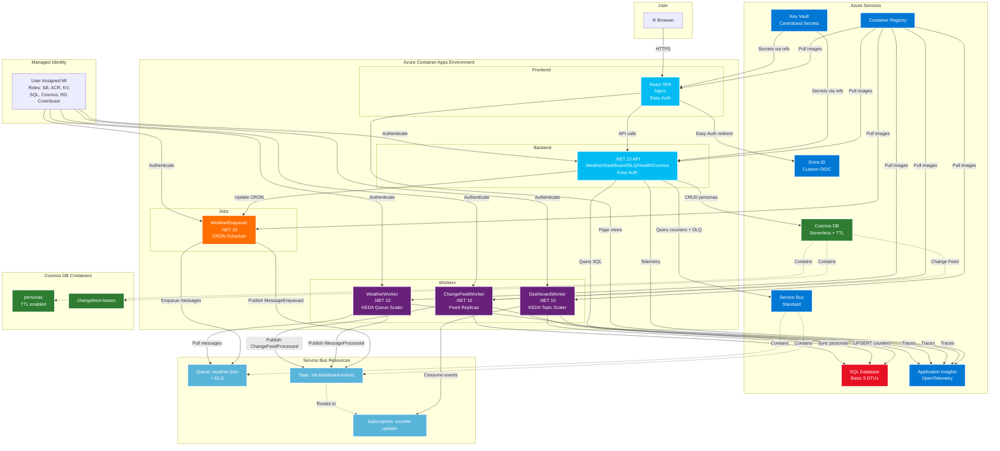

# Container App POC — Easy Auth + Full-Stack

POC de Azure Container Apps con Easy Auth (Entra ID), React + .NET 10, Cosmos DB Change Feed, Container Jobs, y telemetría con Application Insights.

## Qué prueba esta POC

Esta POC valida que se puede construir **una solución distribuida que se opera como una sola aplicación**. Cada componente corre como pod independiente en Azure, pero el dashboard los unifica dando visibilidad de negocio sobre qué está pasando.

| # | Prueba | Qué demuestra |
|---|--------|---------------|
| 1 | **Autenticación y Autorización (Easy Auth)** | Una SPA y una API pueden estar protegidas por Entra ID sin escribir código de auth. La app reconoce quién está logueado, sus roles (User/Admin), obtiene access tokens para llamar a la API, y la API valida identidad + controla autorización. Platform-managed, zero-code auth. |
| 2 | **Mensajería (Service Bus)** | Comunicación entre componentes distribuidos via queue (point-to-point) y topic/subscription (pub-sub). Peek-lock para procesamiento seguro. Dead-Letter Queue para mensajes fallidos con UI de gestión (peek, editar, reencolar, descartar). |
| 3 | **Container App Environment** | Funciona como un cluster Kubernetes managed que contiene dentro todos los workloads de la solución: apps web, APIs, workers de negocio, workers internos, y jobs programados — cada uno escalando independientemente. |
| 4 | **├─ Apps Web (Frontend + API)** | La cara visible: SPA React + API .NET 10 que representan el dashboard operativo. Muestran que todo lo distribuido se puede operar desde un solo lugar. |
| 5 | **├─ Worker de Negocio** | Un proceso que despierta cuando hay mensajes en la queue (KEDA scale 0→N), procesa lógica de negocio, y vuelve a escalar a cero. Reemplaza Windows Services / Hangfire consumers. |
| 6 | **├─ Workers Internos** | Procesos que mantienen la solución operativa: (a) el que procesa eventos para informar al dashboard qué está pasando en el sistema distribuido, (b) el que implementa Change Feed Processor para detectar cambios en Cosmos DB. |
| 7 | **├─ Container Job (CRON)** | Algo que despierta, ejecuta y termina — por definición no es una app. Reemplaza tareas croneadas de Hangfire. Sirve para despertar generadores, ejecutar batch, y morir. Schedule editable desde UI. |
| 8 | **Cosmos DB** | Base NoSQL con TTL para que los documentos desaparezcan automáticamente (ej: 45 días). Change Feed (modo LatestVersion) para detectar solo inserts y modificaciones en tiempo real — patrón que servirá para popular el modelo estrella desde eventos de cambio. No captura deletes (requiere modo AllVersionsAndDeletes). |
| 9 | **Dashboard Operativo Unificado** | Que en un contexto de muchos recursos Azure con cada componente corriendo como pod independiente, el dashboard da la noción de que es **un todo, una sola aplicación**. Se puede construir algo orientado al negocio para saber qué está pasando y poder operar la solución distribuida desde un solo lugar. |
| 10 | **Key Vault (Secretos Centralizados)** | Los secretos viven únicamente en Key Vault — los Container Apps los referencian via `keyVaultUrl`, nunca los copian. Rotación sin redeploy: actualizar el secret en KV + nueva revisión del Container App. |
| 11 | **Managed Identity (Zero Secrets)** | Todos los componentes se autentican entre sí sin connection strings ni passwords. Service Bus, Cosmos DB, SQL, Key Vault, ACR — todo via RBAC + User Assigned Managed Identity. |
| 12 | **Infrastructure as Code** | Todo reproducible desde Bicep modular con feature flags. Se puede borrar y recrear el ambiente completo, o deployar incrementalmente solo lo que cambió (`deployCosmosDB=true`, `deployJob=true`, etc.). |
| 13 | **Observabilidad E2E** | Distributed tracing desde que un mensaje se encola hasta que se refleja en el dashboard. OpenTelemetry + App Insights + KQL. Cada componente distribuido reporta telemetría que se correlaciona en un solo lugar. |

## Tags de referencia

| Tag | Descripción | Cuándo volver |
|-----|-------------|---------------|
| `v0.2-stable` | Easy Auth + Worker + KEDA funcionando end-to-end | Si algo se rompe durante la implementación del Dashboard, comparar con `git diff v0.2-stable` |

Para volver a este punto: `git checkout v0.2-stable`
Para comparar cambios: `git diff v0.2-stable..HEAD`

## Arquitectura



**Flujos end-to-end:**

1. **Queue Processing:** `WeatherEnqueuer Job` (CRON) → encola N mensajes a `weather-jobs` + publica `MessageEnqueued` a topic
2. **Worker Processing:** `WeatherWorker` (KEDA 0→10) → procesa mensaje → publica `MessageProcessed` a topic
3. **Dashboard Counters:** `DashboardWorker` (KEDA 0→10) → consume eventos → UPSERT en SQL `QueueCounters`
4. **Change Feed Sync:** UI crea/edita persona en Cosmos → `ChangeFeedWorker` detecta cambio → sync a SQL + publica `ChangeFeedProcessed`
5. **TTL Auto-Delete:** Documento con `ttl: N` → Cosmos lo borra automáticamente después de N segundos (el Change Feed en modo LatestVersion no captura deletes — solo inserts y updates)
6. **Dashboard UI:** Frontend → GET `/api/dashboard/kpi` → muestra contadores + DLQ + job executions en tiempo real

## Stack

| Capa | Tecnología |
|------|-----------|
| Frontend | React 18 + TypeScript + Vite + Tailwind CSS + shadcn/ui + Nginx |
| Backend | .NET 10 API (Controllers + Easy Auth + Dashboard + Cosmos CRUD + Jobs API) |
| Workers | .NET 10 Worker Service + Service Bus + KEDA (scale 0→10) |
| Change Feed | .NET 10 Worker Service + Cosmos Change Feed Processor (fixed replicas) |
| Container Jobs | .NET 10 Generic Host + Schedule Trigger (CRON) + Managed Identity |
| Database | Azure SQL Database (Basic 5 DTUs) — counters, personas sync, job executions |
| NoSQL | Azure Cosmos DB (Serverless) — personas, leases, per-document TTL |
| Auth | Easy Auth (Custom OIDC) + App Roles (User/Admin) |
| Messaging | Azure Service Bus Standard — queue + topic/subscription + DLQ |
| Secrets | Azure Key Vault (references desde Container Apps) |
| Infra | Azure Container Apps + ACR + App Insights + Log Analytics |
| IaC | Bicep modular + feature flags (deploy incremental) |

## Estructura

```
container-app-poc/
├── src/
│   ├── frontend/                       # React SPA + nginx
│   │   ├── src/context/                # AuthContext (Easy Auth)
│   │   ├── src/hooks/                  # useApi, useJobsApi
│   │   ├── src/pages/                  # Home, Admin, Dashboard, DlqManager, Health, Scheduler, ChangeFeed
│   │   ├── nginx.conf                  # /_authinfo endpoint
│   │   └── Dockerfile
│   ├── backend/WeatherApi/             # .NET 10 API
│   │   ├── Controllers/                # Weather, Auth, Dashboard, DlqManager, Health, CosmosPersonas, Sync, Jobs
│   │   ├── Models/                     # PersonaDto (TTL), DashboardModels
│   │   ├── Attributes/                 # RequireAuth, RequireRole
│   │   ├── Services/                   # EasyAuthService, CosmosSystemTextJsonSerializer, InfrastructureHealthService
│   │   └── Dockerfile
│   ├── worker/
│   │   ├── WeatherWorker/              # .NET 10 Worker Service (Service Bus queue + KEDA)
│   │   │   ├── Handlers/               # MessageDispatcher, DefaultHandler, DLQ simulations
│   │   │   ├── Services/               # ServiceBusWorker
│   │   │   ├── Program.cs              # DI + OpenTelemetry + Topic Sender
│   │   │   └── Dockerfile
│   │   ├── DashboardWorker/            # .NET 10 Worker Service (Service Bus topic + KEDA)
│   │   │   ├── Services/               # DashboardWorkerService (topic processor + SQL UPSERT)
│   │   │   ├── Models/                 # DashboardEvent (queue + Change Feed events)
│   │   │   ├── Data/                   # DashboardDbContext + Entities (QueueCounter, PersonaSync, ChangeFeedCounter)
│   │   │   ├── Configuration/          # ServiceBusOptions, SqlOptions
│   │   │   ├── Program.cs              # DI + OpenTelemetry
│   │   │   └── Dockerfile
│   │   └── ChangeFeedWorker/           # .NET 10 Worker Service (Cosmos Change Feed + fixed replicas)
│   │       ├── Services/               # ChangeFeedWorkerService (Change Feed Processor) + ChangeFeedHandler
│   │       ├── Models/                 # Persona (Cosmos document)
│   │       ├── Data/                   # DashboardDbContext + Entities (PersonaSync, ChangeFeedCounter)
│   │       ├── Configuration/          # CosmosOptions
│   │       ├── Program.cs              # DI + OpenTelemetry + Cosmos Client + Service Bus
│   │       └── Dockerfile
│   ├── jobs/
│   │   └── WeatherEnqueuer/            # Container App Job (CRON schedule trigger)
│   │       ├── Services/               # EnqueuerService (queue + topic sender)
│   │       ├── Program.cs              # DI + AddAzureClients + Managed Identity
│   │       └── Dockerfile              # Debian base (.NET 10 + Alpine = SIGSEGV)
│   └── tools/ServiceBusEnqueuer/       # Console app — encola mensajes + publica eventos (dev/test local)
│       └── Program.cs
├── biceps/
│   ├── main.bicep                      # Orquestador principal (Worker + Dashboard + Cosmos opcionales)
│   ├── easyauth.bicep                  # Easy Auth config (separado)
│   └── modules/
│       ├── container-registry.bicep
│       ├── container-app.bicep         # Frontend + Backend Container Apps
│       ├── worker-container-app.bicep  # WeatherWorker + KEDA queue scaler
│       ├── dashboard-worker-container-app.bicep  # DashboardWorker + KEDA topic scaler
│       ├── changefeed-worker-container-app.bicep  # ChangeFeedWorker (fixed replicas, no KEDA)
│       ├── container-app-job.bicep     # Container App Job (WeatherEnqueuer CRON)
│       ├── service-bus.bicep           # Service Bus + Queue (weather-jobs) + Topic (nd-dashboard-events) + Subscription
│       ├── sql-database.bicep          # SQL Server + Database (Entra ID admin)
│       ├── cosmos-db.bicep             # Cosmos DB + Containers (personas, leases, errors) + role assignment
│       └── managed-identity.bicep      # User Assigned MI + roles (SB, ACR, SQL, Cosmos, KV)
├── sql/
│   ├── 001-dashboard-schema.sql        # QueueCounters + ComponentHealth tables
│   ├── 002-add-discarded-count.sql     # Add discardedCount column
│   ├── 003-changefeed-tables.sql       # PersonasSync + ChangeFeedCounters
│   └── 003_JobExecutions.sql           # JobExecutions tracking table
└── docs/
    ├── DEPLOYMENT.md                   # ⭐ Deployment E2E completo (Pasos 1-8) — FUENTE DE VERDAD
    ├── EASY-AUTH-TUTORIAL.md           # Guía completa de Easy Auth
    ├── WORKER-KEDA-DESIGN.md           # Diseño Worker + KEDA + Service Bus
    ├── dashboard-poc.md                # Dashboard POC: diseño, arquitectura, implementación
    ├── change-feed-poc.md              # Change Feed POC: arquitectura, eventos, sync Cosmos→SQL
    └── DEPLOYMENT-CHANGE-FEED-POC.md   # Deployment específico del Change Feed POC
```

---

## 🚀 Deployment

**→ Ver [`docs/DEPLOYMENT.md`](docs/DEPLOYMENT.md)** — guía E2E validada para deploy desde cero.

Cubre: infra base → build imágenes → Container Apps + Workers + Job → SQL setup → Easy Auth → validación.

**Comandos rápidos para re-deploy (después del deploy inicial):**

```bash
RG="rg-far-container-app-easyauth"
ACR_NAME=$(az deployment group show -g $RG --name main --query 'properties.outputs.acrName.value' -o tsv)

# Rebuild + redeploy backend
az acr build --registry $ACR_NAME --image weather-api:latest --file src/backend/WeatherApi/Dockerfile src/backend/WeatherApi
az containerapp update -n ca-weather-be-dev -g $RG --image ${ACR_NAME}.azurecr.io/weather-api:latest --revision-suffix "be-$(date +%s)"

# Rebuild + redeploy frontend
az acr build --registry $ACR_NAME --image weather-frontend:latest --file src/frontend/Dockerfile src/frontend
az containerapp update -n ca-weather-fe-dev -g $RG --image ${ACR_NAME}.azurecr.io/weather-frontend:latest --revision-suffix "fe-$(date +%s)"
```

---

## 🧹 Limpiar recursos

```bash
az group delete --name rg-far-container-app-easyauth --yes --no-wait
```

---

## 📊 Monitoreo y Observabilidad

Telemetría end-to-end con **OpenTelemetry + Azure Monitor**:

**Backend (.NET 10)**:
- Paquete: `Azure.Monitor.OpenTelemetry.AspNetCore` → `UseAzureMonitor()`
- Auto-recolecta: HTTP requests, dependencies, ILogger logs, exceptions, metrics
- [Docs: Enable OpenTelemetry](https://learn.microsoft.com/azure/azure-monitor/app/opentelemetry-enable)

**Workers (.NET 10)**:
- `AppContext.SetSwitch("Azure.Experimental.EnableActivitySource", true)` habilita Service Bus Activities
- Cada mensaje procesado genera un Activity span con `operation_Id` para correlación
- [Docs: Distributed tracing](https://learn.microsoft.com/azure/azure-monitor/app/distributed-tracing-telemetry-correlation)

**Frontend (React SPA)**:
- Page views, custom events, route tracking via Application Insights JS SDK

**Managed OTel Agent (platform level)**:
- Configurado en el Container App Environment vía Bicep
- Reenvía traces y logs a App Insights sin cambios en la app
- [Docs: OTel agents in Container Apps](https://learn.microsoft.com/azure/container-apps/opentelemetry-agents)

**Arquitectura dual**: la app envía directo a App Insights (via SDK) + el managed agent captura logs/traces adicionales a nivel plataforma. Esto garantiza visibilidad completa.

---

### Queries KQL útiles

**1. Dashboard general — métricas de todos los componentes (últimas 24h)**

```kql
// Resumen de requests por componente
requests 
| where timestamp > ago(24h)
| summarize 
    Total = count(),
    Exitosos = countif(success == true),
    Fallidos = countif(success == false),
    DuracionPromedio = avg(duration),
    P95 = percentile(duration, 95)
  by cloud_RoleName, name
| order by Total desc
```

**2. Frontend — Page views y rutas más visitadas**

```kql
pageViews 
| where timestamp > ago(24h)
| summarize Visitas = count(), UsuariosUnicos = dcount(user_Id)
  by name, url
| order by Visitas desc
```

**3. Backend API — requests por endpoint con tasa de error**

```kql
requests 
| where timestamp > ago(24h)
| where cloud_RoleName contains "ca-weather-be"
| summarize 
    Total = count(),
    Exitosos = countif(success == true),
    Fallidos = countif(success == false),
    TasaError = round(100.0 * countif(success == false) / count(), 2),
    DuracionP95 = percentile(duration, 95)
  by name
| order by Total desc
```

**4. Workers — mensajes procesados y tasa de éxito**

```kql
// WeatherWorker y DashboardWorker
traces 
| where timestamp > ago(24h)
| where cloud_RoleName contains "ca-weather-worker" or cloud_RoleName contains "ca-dashboard-worker"
| where message contains "procesado" or message contains "completado" or message contains "processed"
| summarize 
    MensajesProcesados = count()
  by cloud_RoleName, bin(timestamp, 5m)
| render timechart 
```

**5. Workers — errores y excepciones con detalles**

```kql
exceptions 
| where timestamp > ago(24h)
| where cloud_RoleName contains "ca-weather-worker" or cloud_RoleName contains "ca-dashboard-worker"
| project 
    timestamp,
    Worker = cloud_RoleName,
    TipoError = type,
    Mensaje = outerMessage,
    MessageId = customDimensions.MessageId,
    DeliveryCount = customDimensions.DeliveryCount,
    Stack = details[0].parsedStack
| order by timestamp desc
```

**6. Distributed Tracing — Flujo completo: Enqueuer → WeatherWorker → Topic → DashboardWorker**

Esta query muestra la correlación end-to-end de un mensaje desde que se encola hasta que actualiza SQL:

```kql
// Encontrar operation_Id de un mensaje realmente procesado por el WeatherWorker
// (requests = mensajes procesados, dependencies = llamadas salientes incluyendo idle polls)
let sampleOperation = requests
| where timestamp > ago(24h)
| where cloud_RoleName contains "ca-weather-worker"
| take 1
| project operation_Id;
// Trazar toda la cadena de eventos para ese operation_Id
union requests, dependencies, traces, exceptions
| where operation_Id in (sampleOperation)
| project 
    timestamp,
    Componente = cloud_RoleName,
    Tipo = itemType,
    Nombre = coalesce(name, message),
    Duracion = duration,
    Exito = success,
    operation_Id,
    operation_ParentId
| order by timestamp asc
```

**7. Distributed Tracing — Correlación Backend API → Service Bus → Worker**

Cuando el backend llama `/api/dlq/requeue`, trace hasta el reprocessing:

```kql
// Buscar una request de requeue
let reqOp = requests
| where timestamp > ago(1h)
| where name contains "POST" and name contains "requeue"
| take 1
| project operation_Id;
// Ver toda la transacción distribuida
union requests, dependencies, traces
| where operation_Id in (reqOp)
| project 
    timestamp,
    Componente = cloud_RoleName,
    Operacion = coalesce(name, message),
    Duracion = duration,
    Detalles = customDimensions
| order by timestamp asc
```

**8. Dashboard Worker — UPSERT SQL performance y errores de concurrencia**

```kql
traces 
| where timestamp > ago(24h)
| where cloud_RoleName contains "ca-dashboard-worker"
| where message contains "UPSERT" or message contains "UPDATE" or message contains "INSERT"
| extend 
    Vertical = tostring(customDimensions.Vertical),
    QueueName = tostring(customDimensions.Queue),
    ProcessType = tostring(customDimensions.ProcessType),
    EventType = tostring(customDimensions.EventType)
| summarize 
    Eventos = count()
  by EventType, Vertical, QueueName, ProcessType, bin(timestamp, 5m)
| render timechart
```

**9. Service Bus DLQ — mensajes que fueron a dead-letter (correlación con worker failures)**

```kql
// Traces de DLQ con contexto del worker
traces 
| where timestamp > ago(24h)
| where message contains "DLQ" or message contains "dead" or message contains "DeadLetter"
| project 
    timestamp,
    Worker = cloud_RoleName,
    Mensaje = message,
    MessageId = customDimensions.MessageId,
    Razon = customDimensions.DeadLetterReason,
    Descripcion = customDimensions.DeadLetterErrorDescription,
    operation_Id
| order by timestamp desc
```

**10. Performance — operaciones más lentas (P95) por componente**

```kql
union requests, dependencies
| where timestamp > ago(24h)
| summarize 
    P95 = percentile(duration, 95),
    P99 = percentile(duration, 99),
    Max = max(duration),
    Promedio = avg(duration),
    Total = count()
  by cloud_RoleName, name, type
| where P95 > 100  // Operaciones > 100ms en P95
| order by P95 desc
```

**11. KEDA Scaling — correlación entre queue depth y réplicas activas**

```kql
// Requiere: Diagnostic Settings en Service Bus → Log Analytics (AllMetrics)
let queueDepth = AzureMetrics
| where ResourceProvider == "MICROSOFT.SERVICEBUS"
| where MetricName == "ActiveMessages"
| summarize ActiveMessages = max(Maximum) by bin(TimeGenerated, 1m);
let workerInstances = traces
| where timestamp > ago(1h)
| where cloud_RoleName contains "ca-weather-worker" or cloud_RoleName contains "ca-dashboard-worker"
| summarize Instancias = dcount(cloud_RoleInstance) by bin(timestamp, 1m), cloud_RoleName;
workerInstances
| join kind=leftouter (queueDepth) on $left.timestamp == $right.TimeGenerated
| project timestamp, Worker = cloud_RoleName, Instancias, ActiveMessages
| render timechart
```

**12. Health Checks — disponibilidad de componentes**

```kql
requests 
| where timestamp > ago(24h)
| where url endswith "/health/ready" or url endswith "/health/live"
| summarize 
    Total = count(),
    Healthy = countif(success == true),
    Unhealthy = countif(success == false),
    Disponibilidad = round(100.0 * countif(success == true) / count(), 2)
  by cloud_RoleName, name
| order by Disponibilidad asc
```

---

### Dashboard Application Insights recomendado

Crear un workbook con estos paneles:

1. **Overview**: requests/sec, success rate, P95 latency por componente
2. **Frontend**: page views, user sessions, errores JavaScript
3. **Backend API**: top endpoints, error rate, slow queries (P95 > 500ms)
4. **Workers**: mensajes procesados/min, DLQ count, excepciones
5. **Distributed Traces**: mapa de dependencias, end-to-end latency
6. **Alerts**: > 5% error rate, P95 > 2s, DLQ count > 10

---

## 📚 Documentación

| Doc | Contenido |
|-----|-----------|
| [docs/DEPLOYMENT.md](docs/DEPLOYMENT.md) | ⭐ **Deployment E2E completo** (Pasos 1-8) — fuente de verdad |
| [docs/EASY-AUTH-TUTORIAL.md](docs/EASY-AUTH-TUTORIAL.md) | Guía completa Easy Auth: App Registrations, Token Store, Custom OIDC, roles |
| [docs/WORKER-KEDA-DESIGN.md](docs/WORKER-KEDA-DESIGN.md) | Diseño Worker + KEDA + Service Bus: arquitectura, DLQ, scaling |
| [docs/dashboard-poc.md](docs/dashboard-poc.md) | Dashboard POC: diseño completo, arquitectura, implementación |
| [docs/change-feed-poc.md](docs/change-feed-poc.md) | Change Feed POC: Cosmos → SQL sync, eventos, TTL |
| [DEVELOPMENT.md](DEVELOPMENT.md) | Desarrollo local |
