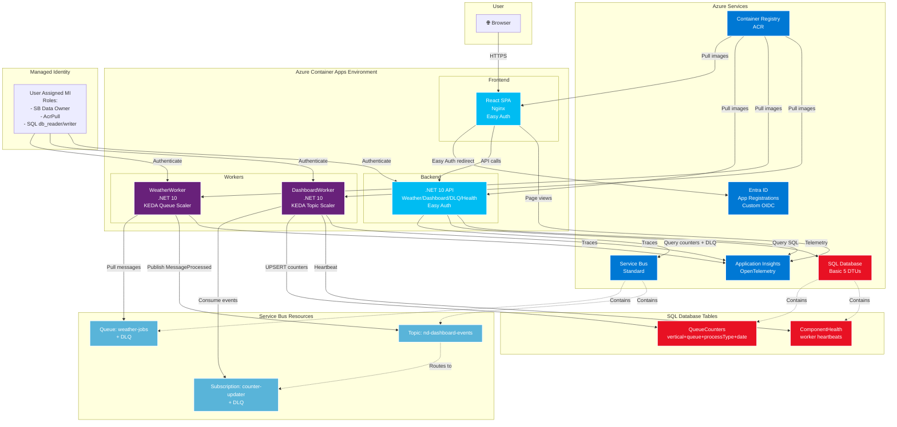

# Container App POC — Easy Auth + Full-Stack

POC de Azure Container Apps con Easy Auth (Entra ID), React + .NET 10, telemetría con Application Insights.

## Tags de referencia

| Tag | Descripción | Cuándo volver |
|-----|-------------|---------------|
| `v0.2-stable` | Easy Auth + Worker + KEDA funcionando end-to-end | Si algo se rompe durante la implementación del Dashboard, comparar con `git diff v0.2-stable` |

Para volver a este punto: `git checkout v0.2-stable`
Para comparar cambios: `git diff v0.2-stable..HEAD`

## Arquitectura



**Flujo end-to-end:**
1. `ServiceBusEnqueuer` → envía mensaje a `weather-jobs` + publica `MessageEnqueued` a `nd-dashboard-events`
2. `WeatherWorker` (KEDA queue scaler 0→10) → procesa mensaje → publica `MessageProcessed` a topic
3. `DashboardWorker` (KEDA topic scaler 0→10) → consume eventos → UPSERT en SQL `QueueCounters`
4. Frontend `/dashboard` → GET `/api/dashboard/kpi` → muestra contadores + DLQ counts en tiempo real (refresh 5s)

## Stack

| Capa | Tecnología |
|------|-----------|
| Frontend | React 18 + TypeScript + Vite + Tailwind CSS + Nginx |
| Backend | .NET 10 API (Controllers + Easy Auth service + Dashboard APIs) |
| Workers | .NET 10 Worker Service + Service Bus + KEDA (scale 0→10) |
| Database | Azure SQL Database (Basic 5 DTUs) |
| Auth | Easy Auth (Custom OIDC) + App Roles (User/Admin) |
| Infra | Azure Container Apps + ACR + Service Bus + SQL + App Insights |
| IaC | Bicep (main.bicep + easyauth.bicep + módulos) |

## Estructura

```
container-app-poc/
├── src/
│   ├── frontend/                       # React SPA + nginx
│   │   ├── src/context/                # AuthContext (Easy Auth)
│   │   ├── src/hooks/                  # useApi (get + post)
│   │   ├── src/pages/                  # HomePage, AdminPage, DashboardPage, DlqManagerPage, HealthPage
│   │   ├── nginx.conf                  # /_authinfo endpoint
│   │   └── Dockerfile
│   ├── backend/WeatherApi/             # .NET 10 API
│   │   ├── Controllers/                # Weather, Auth, Dashboard, DlqManager, Health
│   │   ├── Models/                     # DashboardModels (DTOs)
│   │   ├── Attributes/                 # RequireAuth, RequireRole
│   │   ├── Services/                   # EasyAuthService
│   │   └── Dockerfile
│   ├── worker/
│   │   ├── WeatherWorker/              # .NET 10 Worker Service (Service Bus queue + KEDA)
│   │   │   ├── Handlers/               # MessageDispatcher, DefaultHandler, DLQ simulations
│   │   │   ├── Services/               # ServiceBusWorker
│   │   │   ├── Program.cs              # DI + OpenTelemetry + Topic Sender
│   │   │   └── Dockerfile
│   │   └── DashboardWorker/            # .NET 10 Worker Service (Service Bus topic + KEDA)
│   │       ├── Services/               # DashboardWorkerService (topic processor + SQL UPSERT)
│   │       ├── Models/                 # DashboardEvent
│   │       ├── Configuration/          # ServiceBusOptions, SqlOptions
│   │       ├── Program.cs              # DI + OpenTelemetry
│   │       └── Dockerfile
│   └── tools/ServiceBusEnqueuer/       # Console app — encola mensajes + publica eventos
│       └── Program.cs
├── biceps/
│   ├── main.bicep                      # Orquestador principal (Worker + Dashboard opcionales)
│   ├── easyauth.bicep                  # Easy Auth config (separado)
│   └── modules/
│       ├── container-registry.bicep
│       ├── container-app.bicep         # Frontend + Backend Container Apps
│       ├── worker-container-app.bicep  # WeatherWorker + KEDA queue scaler
│       ├── dashboard-worker-container-app.bicep  # DashboardWorker + KEDA topic scaler
│       ├── service-bus.bicep           # Service Bus + Queue (weather-jobs) + Topic (nd-dashboard-events) + Subscription
│       ├── sql-database.bicep          # SQL Server + Database (Entra ID admin)
│       └── managed-identity.bicep      # User Assigned MI + roles (SB Data Owner, AcrPull, SQL)
├── sql/
│   └── 001-dashboard-schema.sql        # QueueCounters + ComponentHealth tables
└── docs/
    ├── EASY-AUTH-TUTORIAL.md           # Guía completa de Easy Auth
    ├── WORKER-KEDA-DESIGN.md           # Diseño Worker + KEDA + Service Bus
    └── dashboard-poc.md                # Dashboard POC: diseño, arquitectura, implementación
```

---

## 🚀 Despliegue Completo (desde cero)

### Variables de entorno

```bash
export RG="rg-far-container-app-easyauth"
export LOCATION="eastus2"
```

### Paso 1: Resource Group

```bash
az group create --name $RG --location $LOCATION
```

### Paso 2: Infraestructura base (sin Container Apps)

```bash
az deployment group create \
  --resource-group $RG \
  --template-file biceps/main.bicep \
  --parameters deployContainerApps=false
```

Crea: ACR, Log Analytics, Application Insights, Container App Environment.

### Paso 3: Build de imágenes en ACR

```bash
ACR_NAME=$(az deployment group show -g $RG --name main \
  --query 'properties.outputs.acrName.value' -o tsv)

# Backend
az acr build --registry $ACR_NAME \
  --image weather-api:latest \
  --file src/backend/WeatherApi/Dockerfile \
  src/backend/WeatherApi

# Frontend
az acr build --registry $ACR_NAME \
  --image weather-frontend:latest \
  --file src/frontend/Dockerfile \
  src/frontend
```

### Paso 4: Deploy Container Apps

```bash
az deployment group create \
  --resource-group $RG \
  --template-file biceps/main.bicep \
  --parameters deployContainerApps=true
```

### Paso 5: Obtener URLs

```bash
FRONTEND_URL=$(az deployment group show -g $RG --name main \
  --query 'properties.outputs.frontendAppUrl.value' -o tsv)
BACKEND_URL=$(az deployment group show -g $RG --name main \
  --query 'properties.outputs.backendAppUrl.value' -o tsv)

echo "Frontend: $FRONTEND_URL"
echo "Backend:  $BACKEND_URL"
```

### Paso 6 (Opcional): Configurar Easy Auth

Ver [docs/EASY-AUTH-TUTORIAL.md](docs/EASY-AUTH-TUTORIAL.md) para la guía completa.

Resumen rápido:

```bash
# 1. Crear App Registrations en Entra ID (ver tutorial)
# 2. Setear secrets en los Container Apps
az containerapp secret set -n ca-weather-fe-dev -g $RG --secrets \
  microsoft-provider-authentication-secret="<FE_CLIENT_SECRET>" \
  token-store-sas="<SAS_URL_FROM_DEPLOYMENT>"

az containerapp secret set -n ca-weather-be-dev -g $RG --secrets \
  microsoft-provider-authentication-secret="<BE_CLIENT_SECRET>"

# 3. Deploy auth config
az deployment group create -g $RG \
  --template-file biceps/easyauth.bicep \
  --parameters \
    frontendClientId="<FE_CLIENT_ID>" \
    backendClientId="<BE_CLIENT_ID>" \
    oidcWellKnownUrl="<OIDC_DISCOVERY_URL>"
```

---

## 🔧 Worker + KEDA (extender ambiente existente)

Si ya tenés la infra base deployada, corré estos pasos para agregar el worker:

### Paso 1: Deploy infra del Worker (Service Bus + MI + roles)

```bash
# Crea Service Bus, Managed Identity con roles (SB Receiver/Sender + AcrPull)
# NO crea el Container App aún (la imagen no existe todavía)
az deployment group create \
  --resource-group $RG \
  --template-file biceps/main.bicep \
  --parameters deployWorker=true deployWorkerApp=false
```

### Paso 2: Build y push imagen del worker

```bash
ACR_NAME=$(az deployment group show -g $RG --name main \
  --query 'properties.outputs.acrName.value' -o tsv)

az acr build --registry $ACR_NAME \
  --image weather-worker:latest \
  --file src/worker/WeatherWorker/Dockerfile \
  src/worker/WeatherWorker
```

### Paso 3: Deploy Worker Container App

```bash
# Ahora que la imagen existe, creamos el Container App con KEDA
az deployment group create \
  --resource-group $RG \
  --template-file biceps/main.bicep \
  --parameters deployWorker=true deployWorkerApp=true
```

Esto crea:
- **Service Bus Namespace** (Standard) + Queue `weather-jobs` (DLQ, maxDeliveryCount:3, lock:5min)
- **User Managed Identity** con roles `Service Bus Data Receiver` + `Sender` + `AcrPull`
- **Worker Container App** con KEDA scaler (1 replica por cada 5 msgs, min:0, max:10)

### Paso 4: Asignar rol de Service Bus a tu usuario (para el enqueuer local)

```bash
# Tu usuario necesita "Azure Service Bus Data Sender" para enviar mensajes desde local
USER_OID=$(az ad signed-in-user show --query id -o tsv)
SB_ID=$(az servicebus namespace list -g $RG --query '[0].id' -o tsv)

az role assignment create \
  --assignee $USER_OID \
  --role "Azure Service Bus Data Sender" \
  --scope $SB_ID
```

### Paso 5: Test — Encolar mensajes (local)

```bash
SB_NS=$(az deployment group show -g $RG --name main \
  --query 'properties.outputs.serviceBusNamespaceFqdn.value' -o tsv)

cd src/tools/ServiceBusEnqueuer
dotnet run -- --namespace $SB_NS --queue weather-jobs --count 1000
```

### Paso 6: Verificar queue y scaling

```bash
SB_NAME=$(az servicebus namespace list -g $RG --query '[0].name' -o tsv)

# Ver tamaño de la cola (mensajes activos + DLQ)
az servicebus queue show -g $RG \
  --namespace-name $SB_NAME \
  --name weather-jobs \
  --query '{active: countDetails.activeMessageCount, deadLetter: countDetails.deadLetterMessageCount, scheduled: countDetails.scheduledMessageCount}' -o table

# Ver réplicas activas del worker
az containerapp replica list -n ca-weather-worker-dev -g $RG -o table

# Ver logs en tiempo real
az containerapp logs show -n ca-weather-worker-dev -g $RG --follow
```

### Verificar DLQ

Los mensajes #10 (exception), #20 (validación) y #30 (timeout) van a la Dead Letter Queue:

```bash
# Contar mensajes en DLQ
az servicebus queue show -g $RG \
  --namespace-name $(az servicebus namespace list -g $RG --query '[0].name' -o tsv) \
  --name weather-jobs \
  --query 'countDetails.deadLetterMessageCount' -o tsv
```

Ver [docs/WORKER-KEDA-DESIGN.md](docs/WORKER-KEDA-DESIGN.md) para el diseño completo.

---

## 📊 Dashboard POC (monitoreo + DLQ management)

**⚠️ Prerrequisito:** Esta sección asume que ya seguiste los pasos de **"🚀 Despliegue Completo (desde cero)"** y **"🔧 Worker + KEDA"** arriba, es decir, ya tenés:
- ACR con imágenes del backend, frontend y WeatherWorker
- Container App Environment
- Service Bus con queue `weather-jobs`
- Managed Identity

Si estás empezando desde cero, **primero completá esas secciones**. Esta sección es para **extender** el ambiente existente con el Dashboard POC.

**Qué agrega el Dashboard POC:**
- **SQL Database** (Basic 5 DTUs) — almacena contadores por vertical + queue + processType + fecha
- **Service Bus Topic `nd-dashboard-events`** + subscription `counter-updater`
- **DashboardWorker** — consume eventos del topic, actualiza contadores en SQL (KEDA topic subscription scaler)
- **Backend APIs actualizados** — `/api/dashboard/kpi`, `/api/dlq/*`, `/api/health/components`
- **Frontend actualizado** — DashboardPage, DlqManagerPage, HealthPage (auto-refresh)

### Paso 1: Deploy infra del Dashboard (SQL + Topic + Subscription)

```bash
# Prereqs: ACR, Container App Environment, Service Bus ya deployados con Worker
# Obtener info del SQL admin (tu usuario de Entra ID)
USER_OID=$(az ad signed-in-user show --query id -o tsv)
USER_UPN=$(az ad signed-in-user show --query userPrincipalName -o tsv)

# Deploy SQL Database + topic + subscription (NO el Dashboard Worker Container App aún)
az deployment group create \
  --resource-group $RG \
  --template-file biceps/main.bicep \
  --parameters deployDashboard=true \
    sqlServerName="sql-weather-dash-$RANDOM" \
    sqlAdminObjectId="$USER_OID" \
    sqlAdminLogin="$USER_UPN" \
    sqlLocation="centralus"

# Si Central US tampoco funciona, probar:
# sqlLocation="westus2" o sqlLocation="westeurope"
```

**Salida esperada:** SQL Server + Database `dashboard-poc`, Topic `nd-dashboard-events`, Subscription `counter-updater`.

### Paso 2: Crear schema SQL

```bash
# Obtener nombre del SQL Server
SQL_SERVER=$(az deployment group show -g $RG --name main \
  --query 'properties.outputs.sqlServerFqdn.value' -o tsv)

# Conectar como Entra ID admin y ejecutar el schema
az sql server show -g $RG --name ${SQL_SERVER%%.database.windows.net} --query fullyQualifiedDomainName

# Usando sqlcmd o Azure Portal Query Editor:
sqlcmd -S $SQL_SERVER -d dashboard-poc -G -i sql/001-dashboard-schema.sql
```

Si no tenés `sqlcmd`, usá **Azure Portal → SQL Database → Query editor (preview)** y pegá el contenido de `sql/001-dashboard-schema.sql`.

### Paso 3: Mapear Managed Identity como usuario SQL (MANUAL)

**⚠️ Paso manual obligatorio**: conectar como Entra ID admin y ejecutar:

```bash
# Obtener el nombre de la Managed Identity
WORKER_IDENTITY_NAME=$(az identity list -g $RG \
  --query "[?contains(name, 'worker')].name" -o tsv)

echo "Worker Identity: $WORKER_IDENTITY_NAME"
# Output: id-weather-worker-dev
```

Luego, conectarse al SQL Server como Entra ID admin y ejecutar:

```sql
-- Usar el nombre exacto de la Managed Identity (ej: id-weather-worker-dev)
CREATE USER [id-weather-worker-dev] FROM EXTERNAL PROVIDER;
ALTER ROLE db_datareader ADD MEMBER [id-weather-worker-dev];
ALTER ROLE db_datawriter ADD MEMBER [id-weather-worker-dev];
GO
```

**Cómo conectarse como Entra ID admin:**

Opción 1: Azure Portal Query Editor
1. Portal → SQL Database `dashboard-poc` → Query editor
2. Login con: "Active Directory authentication"
3. Pegar el SQL de arriba

Opción 2: sqlcmd con Entra ID
```bash
SQL_SERVER=$(az deployment group show -g $RG --name main \
  --query 'properties.outputs.sqlServerFqdn.value' -o tsv)

sqlcmd -S $SQL_SERVER -d dashboard-poc -G \
  -Q "CREATE USER [$WORKER_IDENTITY_NAME] FROM EXTERNAL PROVIDER; ALTER ROLE db_datareader ADD MEMBER [$WORKER_IDENTITY_NAME]; ALTER ROLE db_datawriter ADD MEMBER [$WORKER_IDENTITY_NAME];"
```
```

### Paso 4: Rebuild imágenes (Backend + WeatherWorker + nuevo DashboardWorker)

**⚠️ Importante:** Si venís de hacer el deploy inicial, las imágenes del backend y WeatherWorker ya existen en el ACR pero están desactualizadas (no tienen el código del Dashboard POC). Necesitás **rebuild** de las 3 imágenes:

```bash
ACR_NAME=$(az deployment group show -g $RG --name main \
  --query 'properties.outputs.acrName.value' -o tsv)

# Backend (REBUILD para incluir nuevos controllers: Dashboard, DlqManager, Health)
az acr build --registry $ACR_NAME \
  --image weather-api:latest \
  --file src/backend/WeatherApi/Dockerfile \
  src/backend/WeatherApi

# WeatherWorker (REBUILD para incluir publicación de eventos al topic)
az acr build --registry $ACR_NAME \
  --image weather-worker:latest \
  --file src/worker/WeatherWorker/Dockerfile \
  src/worker/WeatherWorker

# DashboardWorker (NUEVO - primera vez)
az acr build --registry $ACR_NAME \
  --image dashboard-worker:latest \
  --file src/worker/DashboardWorker/Dockerfile \
  src/worker/DashboardWorker

# Frontend (REBUILD para incluir nuevas páginas: Dashboard, DlqManager, Health)
az acr build --registry $ACR_NAME \
  --image weather-frontend:latest \
  --file src/frontend/Dockerfile \
  src/frontend
```

### Paso 5: Redeploy Backend + Frontend + WeatherWorker, y deploy DashboardWorker

**⚠️ Importante:** Antes de deployar el DashboardWorker, necesitás re-deployar el main.bicep para que los nuevos outputs (`containerAppEnvironmentId`, `workerIdentityId`) estén disponibles:

```bash
# Re-deploy main.bicep (actualiza outputs, no cambia recursos existentes)
# IMPORTANTE: Usar el MISMO sqlServerName que ya existe (no generar uno nuevo con $RANDOM)
SQL_SERVER_NAME=$(az deployment group show -g $RG --name main \
  --query 'properties.outputs.sqlServerFqdn.value' -o tsv | cut -d'.' -f1)

az deployment group create \
  --resource-group $RG \
  --template-file biceps/main.bicep \
  --parameters deployDashboard=true \
    sqlServerName="$SQL_SERVER_NAME" \
    sqlAdminObjectId="$USER_OID" \
    sqlAdminLogin="$USER_UPN" \
    sqlLocation="centralus"
```

Ahora que las 4 imágenes están actualizadas en el ACR, redeploy los Container Apps existentes y crea el nuevo DashboardWorker:

```bash
# Redeploy Backend (pull nueva imagen con controllers Dashboard/DlqManager/Health)
az containerapp update -n ca-weather-be-dev -g $RG

# Redeploy Frontend (pull nueva imagen con páginas Dashboard/DlqManager/Health)
az containerapp update -n ca-weather-fe-dev -g $RG

# Redeploy WeatherWorker (pull nueva imagen con publicación de eventos)
az containerapp update -n ca-weather-worker-dev -g $RG

# Obtener SQL connection string
SQL_SERVER=$(az deployment group show -g $RG --name main \
  --query 'properties.outputs.sqlServerFqdn.value' -o tsv)
SQL_DB=$(az deployment group show -g $RG --name main \
  --query 'properties.outputs.sqlDatabaseName.value' -o tsv)
SQL_CONN="Server=${SQL_SERVER};Database=${SQL_DB};Authentication=Active Directory Default"

# Deploy DashboardWorker Container App (NUEVO - primera vez)
az deployment group create \
  --resource-group $RG \
  --template-file biceps/modules/dashboard-worker-container-app.bicep \
  --parameters \
    containerAppName="ca-dashboard-worker-dev" \
    environmentId="$(az deployment group show -g $RG --name main --query 'properties.outputs.containerAppEnvironmentId.value' -o tsv)" \
    containerImage="${ACR_NAME}.azurecr.io/dashboard-worker:latest" \
    acrName="$ACR_NAME" \
    managedIdentityId="$(az deployment group show -g $RG --name main --query 'properties.outputs.workerIdentityId.value' -o tsv)" \
    managedIdentityClientId="$(az deployment group show -g $RG --name main --query 'properties.outputs.workerIdentityClientId.value' -o tsv)" \
    serviceBusNamespaceFqdn="$(az deployment group show -g $RG --name main --query 'properties.outputs.serviceBusNamespaceFqdn.value' -o tsv)" \
    sqlConnectionString="$SQL_CONN" \
    appInsightsConnectionString="$(az deployment group show -g $RG --name main --query 'properties.outputs.appInsightsConnectionString.value' -o tsv)"
```

### Paso 6: Test — Encolar mensajes y verificar eventos

```bash
SB_NS=$(az deployment group show -g $RG --name main \
  --query 'properties.outputs.serviceBusNamespaceFqdn.value' -o tsv)

# El enqueuer ahora publica eventos a nd-dashboard-events
cd src/tools/ServiceBusEnqueuer
dotnet run -- --namespace $SB_NS --queue weather-jobs --count 100
```

### Paso 7: Verificar Dashboard Worker escalando

```bash
# Ver mensajes en subscription
SB_NAME=$(az servicebus namespace list -g $RG --query '[0].name' -o tsv)
az servicebus topic subscription show -g $RG \
  --namespace-name $SB_NAME \
  --topic-name nd-dashboard-events \
  --name counter-updater \
  --query 'countDetails.{active:activeMessageCount,deadLetter:deadLetterMessageCount}' -o table

# Ver réplicas del Dashboard Worker (KEDA topic subscription scaler)
az containerapp replica list -n ca-dashboard-worker-dev -g $RG -o table

# Logs del Dashboard Worker
az containerapp logs show -n ca-dashboard-worker-dev -g $RG --follow
```

### Paso 8: Acceder al Dashboard UI

```bash
FRONTEND_URL=$(az deployment group show -g $RG --name main \
  --query 'properties.outputs.frontendAppUrl.value' -o tsv)

echo "Dashboard: ${FRONTEND_URL}/dashboard"
echo "Health:    ${FRONTEND_URL}/health"
echo "DLQ Mgmt:  ${FRONTEND_URL}/dashboard/dlq/weather-jobs"
```

**Páginas:**
- `/dashboard` — KPIs en tiempo real (auto-refresh 5s): contadores por vertical + queue + processType
- `/dashboard/dlq/:queueName` — Gestión de DLQ: peek, editar body, reencolar, descartar
- `/health` — Estado de componentes (auto-refresh 30s)

### Paso 9: Verificar end-to-end

```sql
-- Consultar contadores en SQL
SELECT vertical, queueName, processType, date, enqueuedCount, processedCount, dlqCount
FROM QueueCounters
ORDER BY date DESC, vertical, queueName, processType;
```

**Flujo completo:**
1. `ServiceBusEnqueuer` → envía mensaje a `weather-jobs` + publica `MessageEnqueued` a topic
2. `WeatherWorker` (KEDA queue scaler) → procesa mensaje → publica `MessageProcessed` a topic
3. `DashboardWorker` (KEDA topic scaler) → consume eventos → UPSERT en SQL
4. Frontend `/dashboard` → GET `/api/dashboard/kpi` → muestra contadores + DLQ counts live

Ver [docs/dashboard-poc.md](docs/dashboard-poc.md) para el diseño completo.

---

## 🔄 Actualizar código (rebuild + redeploy)

```bash
ACR_NAME=$(az deployment group show -g $RG --name main \
  --query 'properties.outputs.acrName.value' -o tsv)

# Rebuild
az acr build --registry $ACR_NAME --image weather-api:latest --file src/backend/WeatherApi/Dockerfile src/backend/WeatherApi

az acr build --registry $ACR_NAME --image weather-frontend:latest --file src/frontend/Dockerfile src/frontend

# Redeploy (force new revision)
az containerapp update -n ca-weather-be-dev -g $RG
az containerapp update -n ca-weather-fe-dev -g $RG
```

---

## 🧹 Limpiar recursos

```bash
az group delete --name $RG --yes --no-wait
```

---

## 📊 Monitoreo y Observabilidad

Telemetría end-to-end con **OpenTelemetry + Azure Monitor**:

**Backend (.NET 10)**:
- Paquete: `Azure.Monitor.OpenTelemetry.AspNetCore` → `UseAzureMonitor()`
- Auto-recolecta: HTTP requests, dependencies, ILogger logs, exceptions, metrics
- [Docs: Enable OpenTelemetry](https://learn.microsoft.com/azure/azure-monitor/app/opentelemetry-enable)

**Workers (.NET 10)**:
- `AppContext.SetSwitch("Azure.Experimental.EnableActivitySource", true)` habilita Service Bus Activities
- Cada mensaje procesado genera un Activity span con `operation_Id` para correlación
- [Docs: Distributed tracing](https://learn.microsoft.com/azure/azure-monitor/app/distributed-tracing-telemetry-correlation)

**Frontend (React SPA)**:
- Page views, custom events, route tracking via Application Insights JS SDK

**Managed OTel Agent (platform level)**:
- Configurado en el Container App Environment vía Bicep
- Reenvía traces y logs a App Insights sin cambios en la app
- [Docs: OTel agents in Container Apps](https://learn.microsoft.com/azure/container-apps/opentelemetry-agents)

**Arquitectura dual**: la app envía directo a App Insights (via SDK) + el managed agent captura logs/traces adicionales a nivel plataforma. Esto garantiza visibilidad completa.

---

### Queries KQL útiles

**1. Dashboard general — métricas de todos los componentes (últimas 24h)**

```kql
// Resumen de requests por componente
requests 
| where timestamp > ago(24h)
| summarize 
    Total = count(),
    Exitosos = countif(success == true),
    Fallidos = countif(success == false),
    DuracionPromedio = avg(duration),
    P95 = percentile(duration, 95)
  by cloud_RoleName, name
| order by Total desc
```

**2. Frontend — Page views y rutas más visitadas**

```kql
pageViews 
| where timestamp > ago(24h)
| summarize Visitas = count(), UsuariosUnicos = dcount(user_Id)
  by name, url
| order by Visitas desc
```

**3. Backend API — requests por endpoint con tasa de error**

```kql
requests 
| where timestamp > ago(24h)
| where cloud_RoleName == "WeatherApi"
| summarize 
    Total = count(),
    Exitosos = countif(success),
    Fallidos = countif(not(success)),
    TasaError = round(100.0 * countif(not(success)) / count(), 2),
    DuracionP95 = percentile(duration, 95)
  by name
| order by Total desc
```

**4. Workers — mensajes procesados y tasa de éxito**

```kql
// WeatherWorker y DashboardWorker
traces 
| where timestamp > ago(24h)
| where cloud_RoleName in ("WeatherWorker", "DashboardWorker")
| where message contains "procesado" or message contains "completado" or message contains "processed"
| summarize 
    MensajesProcesados = count()
  by cloud_RoleName, bin(timestamp, 5m)
| render timechart 
```

**5. Workers — errores y excepciones con detalles**

```kql
exceptions 
| where timestamp > ago(24h)
| where cloud_RoleName in ("WeatherWorker", "DashboardWorker")
| project 
    timestamp,
    Worker = cloud_RoleName,
    TipoError = type,
    Mensaje = outerMessage,
    MessageId = customDimensions.MessageId,
    DeliveryCount = customDimensions.DeliveryCount,
    Stack = details[0].parsedStack
| order by timestamp desc
```

**6. Distributed Tracing — Flujo completo: Enqueuer → WeatherWorker → Topic → DashboardWorker**

Esta query muestra la correlación end-to-end de un mensaje desde que se encola hasta que actualiza SQL:

```kql
// Encontrar operation_Id de una operación reciente del WeatherWorker
let sampleOperation = dependencies
| where timestamp > ago(1h)
| where cloud_RoleName == "WeatherWorker"
| where type == "Azure Service Bus"
| take 1
| project operation_Id;
// Trazar toda la cadena de eventos para ese operation_Id
union requests, dependencies, traces, exceptions
| where operation_Id in (sampleOperation)
| project 
    timestamp,
    Componente = cloud_RoleName,
    Tipo = itemType,
    Nombre = coalesce(name, message),
    Duracion = duration,
    Exito = success,
    operation_Id,
    operation_ParentId
| order by timestamp asc
```

**7. Distributed Tracing — Correlación Backend API → Service Bus → Worker**

Cuando el backend llama `/api/dlq/requeue`, trace hasta el reprocessing:

```kql
// Buscar una request de requeue
let reqOp = requests
| where timestamp > ago(1h)
| where name == "POST /api/dlq/requeue"
| take 1
| project operation_Id;
// Ver toda la transacción distribuida
union requests, dependencies, traces
| where operation_Id in (reqOp)
| project 
    timestamp,
    Componente = cloud_RoleName,
    Operacion = coalesce(name, message),
    Duracion = duration,
    Detalles = customDimensions
| order by timestamp asc
```

**8. Dashboard Worker — UPSERT SQL performance y errores de concurrencia**

```kql
traces 
| where timestamp > ago(24h)
| where cloud_RoleName == "DashboardWorker"
| where message contains "UPSERT" or message contains "UPDATE" or message contains "INSERT"
| extend 
    Vertical = tostring(customDimensions.Vertical),
    QueueName = tostring(customDimensions.Queue),
    ProcessType = tostring(customDimensions.ProcessType),
    EventType = tostring(customDimensions.EventType)
| summarize 
    Eventos = count()
  by EventType, Vertical, QueueName, ProcessType, bin(timestamp, 5m)
| render timechart
```

**9. Service Bus DLQ — mensajes que fueron a dead-letter (correlación con worker failures)**

```kql
// Traces de DLQ con contexto del worker
traces 
| where timestamp > ago(24h)
| where message contains "DLQ" or message contains "dead" or message contains "DeadLetter"
| project 
    timestamp,
    Worker = cloud_RoleName,
    Mensaje = message,
    MessageId = customDimensions.MessageId,
    Razon = customDimensions.DeadLetterReason,
    Descripcion = customDimensions.DeadLetterErrorDescription,
    operation_Id
| order by timestamp desc
```

**10. Performance — operaciones más lentas (P95) por componente**

```kql
union requests, dependencies
| where timestamp > ago(24h)
| summarize 
    P95 = percentile(duration, 95),
    P99 = percentile(duration, 99),
    Max = max(duration),
    Promedio = avg(duration),
    Total = count()
  by cloud_RoleName, name, type
| where P95 > 100  // Operaciones > 100ms en P95
| order by P95 desc
```

**11. KEDA Scaling — correlación entre queue depth y réplicas activas**

```kql
// Combinar métricas de Service Bus con traces de workers
let queueMetrics = customMetrics
| where timestamp > ago(1h)
| where name == "ActiveMessages"  // Métrica de Service Bus (si está configurada)
| project timestamp, ActiveMessages = value;
let workerInstances = traces
| where timestamp > ago(1h)
| where cloud_RoleName in ("WeatherWorker", "DashboardWorker")
| summarize Instancias = dcount(cloud_RoleInstance) by bin(timestamp, 1m), cloud_RoleName;
workerInstances
| join kind=leftouter (queueMetrics) on timestamp
| project timestamp, Worker = cloud_RoleName, Instancias, ActiveMessages
| render timechart
```

**12. Health Checks — disponibilidad de componentes**

```kql
requests 
| where timestamp > ago(24h)
| where url endswith "/health/ready" or url endswith "/health/live"
| summarize 
    Total = count(),
    Healthy = countif(success),
    Unhealthy = countif(not(success)),
    Disponibilidad = round(100.0 * countif(success) / count(), 2)
  by cloud_RoleName, name
| order by Disponibilidad asc
```

---

### Dashboard Application Insights recomendado

Crear un workbook con estos paneles:

1. **Overview**: requests/sec, success rate, P95 latency por componente
2. **Frontend**: page views, user sessions, errores JavaScript
3. **Backend API**: top endpoints, error rate, slow queries (P95 > 500ms)
4. **Workers**: mensajes procesados/min, DLQ count, excepciones
5. **Distributed Traces**: mapa de dependencias, end-to-end latency
6. **Alerts**: > 5% error rate, P95 > 2s, DLQ count > 10

---

## 📚 Documentación

| Doc | Contenido |
|-----|-----------|
| [docs/EASY-AUTH-TUTORIAL.md](docs/EASY-AUTH-TUTORIAL.md) | Guía completa Easy Auth: App Registrations, Token Store, Custom OIDC, roles |
| [docs/WORKER-KEDA-DESIGN.md](docs/WORKER-KEDA-DESIGN.md) | Diseño Worker + KEDA + Service Bus: arquitectura, DLQ, scaling |
| [docs/dashboard-poc.md](docs/dashboard-poc.md) | Dashboard POC: diseño completo, arquitectura, implementación paso a paso |
| [DEVELOPMENT.md](DEVELOPMENT.md) | Desarrollo local |
| [DEPLOYMENT.md](DEPLOYMENT.md) | Detalles de deployment |


