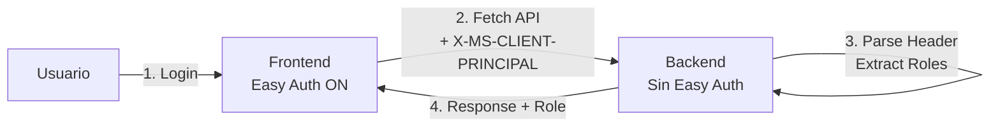

# Tutorial: Easy Auth con Roles en Azure Container Apps

Este tutorial te guía paso a paso para configurar **Easy Auth** con **Microsoft Entra ID** usando el **approach recomendado por Microsoft** para aplicaciones Frontend + Backend.

## 🎯 Arquitectura Recomendada

**Easy Auth SOLO en el Frontend** (approach simple y seguro):



**Por qué este approach:**
- ✅ Usuario se autentica **una sola vez** en el Frontend
- ✅ Backend recibe **automáticamente** headers de autenticación
- ✅ **No requiere OAuth scopes** entre apps (mucho más simple)
- ✅ Recomendado por Microsoft para este patrón arquitectural

## 🎯 Objetivo

Al finalizar este tutorial:
- ✅ Frontend protegido con Easy Auth
- ✅ Roles personalizados configurados en Entra ID
- ✅ Roles incluidos en el access token
- ✅ Frontend muestra usuario logueado + email
- ✅ Backend lee roles del header `X-MS-CLIENT-PRINCIPAL`
- ✅ Frontend muestra el rol en los datos

## 📋 Requisitos Previos

- ✅ Frontend y Backend desplegados en Azure Container Apps
- ✅ Permisos de **Application Administrator** en Microsoft Entra ID
- ✅ Permisos de **Contributor** en los Container Apps

---

## Parte 1: Configurar App Registration con Roles

### Paso 1: Crear App Registration

```bash
# Obtener las URLs de tus apps
export RESOURCE_GROUP="rg-far-container-app-easyauth"

FRONTEND_URL=$(az containerapp show \
  --name ca-weather-fe-dev \
  --resource-group $RESOURCE_GROUP \
  --query 'properties.configuration.ingress.fqdn' -o tsv)

BACKEND_URL=$(az containerapp show \
  --name ca-weather-be-dev \
  --resource-group $RESOURCE_GROUP \
  --query 'properties.configuration.ingress.fqdn' -o tsv)

echo "Frontend: https://$FRONTEND_URL"
echo "Backend:  https://$BACKEND_URL"
```

### Paso 2: Registrar Frontend App en Entra ID

1. Azure Portal → **Microsoft Entra ID**
2. **App registrations** → **+ New registration**

**Name**: `ContainerApp-Weather-Frontend`

**Supported account types**: `Accounts in this organizational directory only (Single tenant)`

**Redirect URI**:
- Platform: **Web**
- URI: `https://<FRONTEND_URL>/.auth/login/aad/callback`

Ejemplo:
```
https://ca-weather-fe-dev.delightfulbush-6f1a4d43.eastus2.azurecontainerapps.io/.auth/login/aad/callback
```

3. Click **Register**

**Anotar**:
- **Application (client) ID**: `xxxxxxxx-xxxx-xxxx-xxxx-xxxxxxxxxxxx`
- **Directory (tenant) ID**: `yyyyyyyy-yyyy-yyyy-yyyy-yyyyyyyyyyyy`

### Paso 3: Configurar Roles en el App Registration

1. En tu App Registration, ve a **App roles**
2. Click **+ Create app role**

**Rol Admin**:
- **Display name**: `Admin`
- **Allowed member types**: `Users/Groups`
- **Value**: `Admin`
- **Description**: `Administrator role with full access`
- **Enable this app role**: ☑️
- Click **Apply**

**Rol User**:
- **Display name**: `User`
- **Allowed member types**: `Users/Groups`
- **Value**: `User`
- **Description**: `Standard user role`
- **Enable this app role**: ☑️
- Click **Apply**

### Paso 4: Configurar Token Configuration

1. En el App Registration, ve a **Token configuration**
2. Click **+ Add optional claim**
3. **Token type**: `Access`
4. Selecciona los claims:
   - ☑️ **email**
   - ☑️ **family_name**
   - ☑️ **given_name**
   - ☑️ **upn**
5. Click **Add**

6. Click **+ Add groups claim**
7. Selecciona **Security groups**
8. **Customize token properties by type**:
   - ID: ☑️ **Group ID**
   - Access: ☑️ **Group ID**
9. Click **Add**

### Paso 5: Configurar API Permissions

1. Ve a **API permissions**
2. Click **+ Add a permission**
3. **Microsoft Graph** → **Delegated permissions**
4. Busca y selecciona:
   - ☑️ **User.Read** (para leer perfil del usuario)
   - ☑️ **email**
   - ☑️ **profile**
   - ☑️ **openid**
5. Click **Add permissions**
6. Click **Grant admin consent for [Your Organization]**
7. Confirma **Yes**

### Paso 6: Crear Client Secret

1. Ve a **Certificates & secrets**
2. **Client secrets** → **+ New client secret**
3. **Description**: `Frontend-Secret-2026`
4. **Expires**: `12 months`
5. Click **Add**
6. **⚠️ COPIA EL VALUE AHORA** (solo se muestra una vez)

### Paso 7: Habilitar ID Tokens

1. Ve a **Authentication**
2. En **Implicit grant and hybrid flows**:
   - ☑️ **ID tokens**
3. Click **Save**

---

## Parte 2: Asignar Roles a Usuarios

### Paso 1: Ir a Enterprise Applications

1. Azure Portal → **Microsoft Entra ID**
2. **Enterprise applications**
3. Busca `ContainerApp-Weather-Frontend`
4. Click en la aplicación

### Paso 2: Requerir Asignación de Usuarios

1. Ve a **Properties**
2. **Assignment required?** → **Yes**
3. Click **Save**

Ahora solo usuarios asignados podrán acceder.

### Paso 3: Asignar tu Usuario con Rol

1. Ve a **Users and groups**
2. Click **+ Add user/group**
3. **Users**: Click **None Selected**
   - Busca tu usuario (tu email)
   - Selecciónalo
   - Click **Select**
4. **Select a role**: Click **None Selected**
   - Selecciona **Admin** (o **User**)
   - Click **Select**
5. Click **Assign**

✅ Ahora tu usuario tiene el rol **Admin** asignado.

### Paso 4: Verificar el Rol Asignado

```bash
# Via Azure CLI (opcional)
az ad sp show --id <APPLICATION_ID> --query appRoles
```

---

## Parte 3: Configurar Easy Auth en el Frontend

### Via Azure Portal

1. Azure Portal → **Container Apps**
2. Selecciona **ca-weather-fe-dev**
3. En el menú izquierdo, bajo **Security** → **Authentication**
4. Click **Add identity provider**
5. **Identity provider**: **Microsoft**

**App registration type**:
- **Provide the details of an existing app registration**

**Application (client) ID**:
- Pega el Client ID del Paso 1.2

**Client secret**:
- Pega el secret del Paso 1.6

**Issuer URL**:
```
https://login.microsoftonline.com/<TENANT_ID>/v2.0
```

**Allowed token audiences** (importante para roles):
```
api://<CLIENT_ID>
<CLIENT_ID>
```

**Restrict access**: **Require authentication**

**Unauthenticated requests**: **HTTP 302 Found redirect**

**Token store**: ☑️ **Enabled**

6. Click **Add**

---

## Parte 4: Verificar que los Roles Aparecen en el Token

### Opción 1: Via Portal (/.auth/me)

1. Abre el frontend en el navegador (serás redirigido a login)
2. Inicia sesión con tu usuario
3. Una vez autenticado, navega a:
```
https://<FRONTEND_URL>/.auth/me
```

4. Busca en el JSON la sección `roles`:
```json
{
  "claims": [
    ...
    {
      "typ": "roles",
      "val": "Admin"
    }
  ]
}
```

### Opción 2: Decodificar el Token

1. En el navegador (con sesión iniciada), abre DevTools → Application → Cookies
2. Busca la cookie `AppServiceAuthSession`
3. Cópiala
4. Usa `curl` para obtener el token:

```bash
curl -H "Cookie: AppServiceAuthSession=<cookie-value>" \
  https://<FRONTEND_URL>/.auth/me
```

5. Busca el claim `roles` en la respuesta

---

## Parte 5: Cómo Funciona el Backend (Sin Easy Auth)

### Backend: Leer Roles del Header `X-MS-CLIENT-PRINCIPAL`

**⚠️ Importante**: El Backend **NO tiene Easy Auth configurado**, pero recibe automáticamente el header `X-MS-CLIENT-PRINCIPAL` cuando el Frontend (con Easy Auth) le envía requests.

**Cómo funciona:**
1. Usuario se autentica en el Frontend (Easy Auth)
2. Frontend hace `fetch()` al Backend con `credentials: 'include'`
3. Easy Auth del Frontend inyecta el header `X-MS-CLIENT-PRINCIPAL` en el request
4. Backend parsea el header y extrae roles

**Formato del header** (Base64 encoded JSON):
```json
{
  "auth_typ": "aad",
  "claims": [
    {"typ": "roles", "val": "Admin"},
    {"typ": "name", "val": "John Doe"},
    {"typ": "http://schemas.xmlsoap.org/ws/2005/05/identity/claims/emailaddress", "val": "john@contoso.com"}
  ],
  "name_typ": "http://schemas.xmlsoap.org/ws/2005/05/identity/claims/emailaddress",
  "role_typ": "http://schemas.microsoft.com/ws/2008/06/identity/claims/role"
}
```

**Código del Backend** (ya implementado en `src/backend/WeatherApi/Program.cs`):
```csharp
string GetClientPrincipal(HttpRequest request)
{
    var header = request.Headers["X-MS-CLIENT-PRINCIPAL"].ToString();
    if (string.IsNullOrEmpty(header)) return "Anonymous";
    
    var decoded = Convert.FromBase64String(header);
    var json = Encoding.UTF8.GetString(decoded);
    var principal = JsonSerializer.Deserialize<ClientPrincipal>(json);
    
    var roleClaim = principal?.Claims?.FirstOrDefault(c => c.Typ == "roles");
    return roleClaim?.Val ?? "User";
}
```

### Frontend: Obtener Info del Usuario

El frontend puede llamar a `/.auth/me` (devuelve info del token) o al endpoint `/userinfo` del Backend (parsea el header).

---

## 🧪 Testing

### Test 1: Verificar Autenticación

```bash
# Sin autenticación (debe redirigir)
curl -I https://<FRONTEND_URL>

# Debe devolver HTTP 302 con Location: login.microsoftonline.com
```

### Test 2: Verificar Roles

1. Login en el navegador
2. Abre DevTools → Console
3. Ejecuta:
```javascript
fetch('/.auth/me')
  .then(r => r.json())
  .then(d => console.log(d[0].user_claims.find(c => c.typ === 'roles')))
```

Deberías ver: `{typ: "roles", val: "Admin"}`

---

## 🔧 Troubleshooting

### Problema: Roles no aparecen en el token

**Solución**:
1. Verifica que asignaste el rol al usuario en **Enterprise Applications** → **Users and groups**
2. Verifica **Token configuration** → **Optional claims** → Access token tiene los claims necesarios
3. Cierra sesión y vuelve a iniciar (/.auth/logout)

### Problema: "AADSTS50105: The signed in user is not assigned to a role"

**Solución**:
1. Ve a **Enterprise applications** → Tu app
2. **Users and groups** → Verifica que tu usuario está asignado
3. Verifica que tiene un **rol** asignado (no solo acceso)

### Problema: Frontend no puede llamar al Backend

**Solución**:
1. Verifica que el Frontend tiene permiso en **API permissions** para llamar al Backend
2. Verifica que el Backend tiene el `Issuer URL` y `Allowed token audiences` correctos
3. Verifica CORS en el backend

---

## Parte 6: Rebuild y Deploy

Una vez configurado Easy Auth en el Frontend, necesitás reconstruir las imágenes con el código actualizado:

```bash
export AZURE_RESOURCE_GROUP="rg-far-container-app-easyauth"
ACR_NAME=$(az deployment group show \
  --resource-group $AZURE_RESOURCE_GROUP \
  --name main \
  --query 'properties.outputs.acrName.value' -o tsv)

# Rebuild backend con CORS fix
az acr build --registry $ACR_NAME \
  --image camuzzi-weather-backend:latest \
  --file src/backend/WeatherApi/Dockerfile \
  src/backend/WeatherApi

# Rebuild frontend
az acr build --registry $ACR_NAME \
  --image camuzzi-weather-frontend:latest \
  --file src/frontend/Dockerfile \
  src/frontend

# Restart apps para que tomen las nuevas imágenes
az containerapp revision restart \
  --name ca-weather-be-dev \
  --resource-group $AZURE_RESOURCE_GROUP

az containerapp revision restart \
  --name ca-weather-fe-dev \
  --resource-group $AZURE_RESOURCE_GROUP
```

---

## 📚 Referencias Oficiales

### Documentación que Soporta este Approach

**1. Authentication and Authorization in Azure Container Apps** (actualizado abril 2026)
- URL: https://learn.microsoft.com/en-us/azure/container-apps/authentication
- **Cita clave** (sección "Feature architecture"):
  > "The authentication and authorization middleware component runs as a **sidecar container** on each replica. When enabled, **every incoming HTTP request passes through the security layer** before being handled by your application."
  
  > "**Relevant information your app needs is provided in request headers**"

**2. Enable Authentication with Microsoft Entra ID** (actualizado febrero 2026)
- URL: https://learn.microsoft.com/en-us/azure/container-apps/authentication-entra
- **Cita clave** (sección "Working with authenticated users"):
  > "See [Access user claims in application code](authentication#access-user-claims-in-application-code) for details on working with authenticated users."
  
  > El header **X-MS-CLIENT-PRINCIPAL** contiene toda la información del usuario autenticado

**3. Configure Authentication User Identities**
- URL: https://learn.microsoft.com/en-us/azure/app-service/configure-authentication-user-identities
- **Cita clave**:
  > "For all language frameworks, App Service makes the claims in the incoming token (whether from an authenticated end user or a client application) available to your code by **injecting them into the request headers**."

### Cuándo SÍ Usar OAuth Scopes (Daemon Client Application)

**Solo cuando necesitas service-to-service sin usuario**:
- URL: https://learn.microsoft.com/en-us/azure/container-apps/authentication-entra#daemon-client-application-service-to-service-calls
- **Caso de uso**: Backend llama a OTROS servicios protegidos (no tu propio backend)
- Ejemplo: Backend → Azure Storage, Cosmos DB, otra API externa

**Para Frontend → Backend propio**: **NO** usar OAuth scopes (approach recomendado de este tutorial)

---

## 🎯 Por Qué NO Usar Easy Auth en el Backend

### Según la Documentación Oficial:

1. **Authentication Flow** (Container Apps docs):
   > "The security container doesn't run in-process. **Relevant information is provided in request headers**."
   
   ✅ El header `X-MS-CLIENT-PRINCIPAL` **ya contiene** toda la información de autenticación

2. **Simplicity** (Architecture best practices):
   > "You're not required to use this feature for authentication. You can use the bundled security features in your web framework."
   
   ✅ El Backend puede parsear headers directamente (más simple que doble autenticación)

3. **Service-to-Service** (When to use OAuth):
   > "Your application can acquire a token to call a Web API **on behalf of itself** (not on behalf of a user)."
   
   ❌ Nuestro caso: Frontend → Backend **on behalf of a user** (no daemon)

### Ventajas del Approach Recomendado:

| Aspecto | Easy Auth Solo Frontend | Easy Auth en Ambos (OAuth) |
|---------|------------------------|----------------------------|
| **Complejidad** | ⭐ Baja | ⭐⭐⭐ Alta |
| **Autenticaciones** | 1 (solo Frontend) | 2 (Frontend + Backend) |
| **App Registrations** | 1 | 2 |
| **OAuth Scopes** | No necesarios | Sí, con permisos delegados |
| **Latencia** | ⚡ Baja | 🐌 Media (validación extra) |
| **Mantenimiento** | ✅ Simple | ⚠️ Complejo |
| **Recomendado por MS** | ✅ Sí (para este patrón) | ❌ No (solo para daemon apps) |

## ✅ Checklist

- [ ] App Registration creado para Frontend
- [ ] Roles (Admin, User) creados en App roles
- [ ] Token configuration con optional claims configurado
- [ ] Client secret creado
- [ ] Usuario asignado con rol Admin
- [ ] Easy Auth habilitado en Frontend
- [ ] ❌ **Backend SIN Easy Auth** (usa header X-MS-CLIENT-PRINCIPAL)
- [ ] Roles aparecen en `/.auth/me`
- [ ] Rebuild backend con código actualizado
- [ ] Rebuild frontend con código actualizado
- [ ] Frontend muestra usuario logueado
- [ ] Backend lee roles del header X-MS-CLIENT-PRINCIPAL
- [ ] Frontend muestra rol que viene del backend

---

## 🔄 Apéndice: OAuth Scopes (Approach Avanzado)

<details>
<summary>Click para expandir: Configuración de OAuth Scopes entre Frontend y Backend (solo si lo necesitas)</summary>

### ⚠️ Solo usar si:
- Tienes **múltiples backends** que necesitan autenticación independiente
- Necesitas **service-to-service** sin usuario (daemon apps)
- Tu arquitectura requiere **permisos delegados granulares**

### Pasos Adicionales:

1. **Registrar Backend App**:
   - Azure Portal → Microsoft Entra ID → App registrations → New
   - Name: `ContainerApp-Weather-Backend-API`
   - Redirect URI: `https://<BACKEND_URL>/.auth/login/aad/callback`

2. **Exponer API**:
   - Expose an API → Application ID URI: `api://weather-backend`
   - Add a scope: `Weather.Read`

3. **Autorizar Frontend**:
   - Frontend App → API permissions → Add permission → My APIs
   - Seleccionar Backend API → Weather.Read
   - Grant admin consent

4. **Configurar Easy Auth en Backend**:
   - Backend Container App → Security → Authentication
   - Add identity provider → Microsoft
   - Usar Backend Client ID y Secret
   - Allowed token audiences: `api://weather-backend`

**Desventajas de este approach**:
- ❌ Mucho más complejo
- ❌ Doble autenticación (overhead)
- ❌ Problemas de propagación (Backend no aparece en My APIs)
- ❌ No recomendado por Microsoft para Frontend → Backend propio

</details>

---

🎉 ¡Listo! Ahora tu aplicación usa Easy Auth con roles siguiendo el **approach recomendado por Microsoft**.
