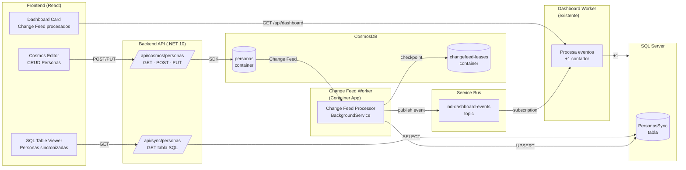

# Change Feed POC — CosmosDB → SQL Server Sync

> **Contexto:** POC para validar el patrón de Change Feed Processor que sincroniza CosmosDB → SQL Server, con telemetría completa y visibilidad en el Dashboard.  
> **Referencia:** [Arquitectura NDv2 §13 — Change Feed](https://github.com/camuzziar/notificaciones-digitales/blob/ndv2/docs/arquitectura-ndv2.md#13-change-feed--sincronizaci%C3%B3n-cosmosdb--sql-server)  
> **Estado:** En diseño  
> **Repositorio:** `container-app-poc`

---

## 1. Objetivo

Probar end-to-end:
1. Insertar/editar un documento "Persona" en CosmosDB **desde la UI**
2. El Change Feed Processor detecta el cambio y lo sincroniza a SQL Server (UPSERT)
3. El procesador publica un evento al **dashboard topic** (`nd-dashboard-events`)
4. El DashboardWorker (ya existente) actualiza un nuevo contador de Change Feed
5. La UI muestra el contador actualizado en una **tarjeta global**
6. Verificar en una **solapa separada** que la tabla SQL refleja los datos de Cosmos

### Prueba de éxito

> Agregar una Persona en la UI → ver que el contador de Change Feed se incrementa → verificar que la tabla SQL tiene el registro.

---

## 2. Arquitectura



---

## 3. Modelo de datos

### 3.1 CosmosDB — Container `personas`

```json
{
  "id": "guid",
  "nombre": "Federico",
  "apellido": "Arambarri",
  "email": "fede@example.com",
  "edad": 30,
  "ciudad": "Buenos Aires",
  "updatedAt": "2026-07-16T12:00:00Z"
}
```

- **Partition key:** `/id` (una partición por persona, simple para POC)
- **Database:** `change-feed-poc`
- **Container:** `personas`
- **Lease container:** `changefeed-leases` (misma database)

### 3.2 SQL Server — Tabla `PersonasSync`

```sql
CREATE TABLE PersonasSync (
    Id NVARCHAR(100) PRIMARY KEY,        -- CosmosDB id
    Nombre NVARCHAR(200) NOT NULL,
    Apellido NVARCHAR(200) NOT NULL,
    Email NVARCHAR(300),
    Edad INT,
    Ciudad NVARCHAR(200),
    CosmosUpdatedAt DATETIME2 NOT NULL,  -- timestamp del documento Cosmos
    SyncedAt DATETIME2 NOT NULL,         -- cuándo se sincronizó
    SyncVersion INT DEFAULT 1            -- se incrementa en cada sync
);
```

**Regla de idempotencia:** solo actualizar si `CosmosUpdatedAt` del documento es más reciente que el valor actual en SQL.

### 3.3 Dashboard — Nuevo contador `ChangeFeedCounters`

```sql
CREATE TABLE ChangeFeedCounters (
    Id INT IDENTITY PRIMARY KEY,
    Collection NVARCHAR(200) NOT NULL,    -- ej: "personas"
    Date DATE NOT NULL,
    SuccessCount INT DEFAULT 0,
    ErrorCount INT DEFAULT 0,
    UpdatedAt DATETIME2 NOT NULL,
    UNIQUE(Collection, Date)
);
```

---

## 4. Evento al Dashboard

### EventType: `ChangeFeedProcessed`

```json
{
  "eventType": "ChangeFeedProcessed",
  "collection": "personas",
  "status": "Success",           // "Success" | "Error"
  "documentId": "guid",
  "timestamp": "2026-07-16T12:00:01Z"
}
```

### EventType: `ChangeFeedError`

```json
{
  "eventType": "ChangeFeedError",
  "collection": "personas",
  "status": "Error",
  "documentId": "guid",
  "errorMessage": "SQL timeout after 3 retries",
  "timestamp": "2026-07-16T12:00:01Z"
}
```

**Procesamiento en DashboardWorker:**
- `ChangeFeedProcessed` → `SuccessCount + 1` para la collection y fecha
- `ChangeFeedError` → `ErrorCount + 1` para la collection y fecha

---

## 5. Componentes nuevos

### 5.1 Change Feed Worker (`src/worker/ChangeFeedWorker`)

| Aspecto | Decisión |
|---|---|
| Runtime | .NET 10 Worker Service (BackgroundService) |
| Hosting | Container App (consistente con WeatherWorker y DashboardWorker) |
| SDK | `Microsoft.Azure.Cosmos` (Change Feed Processor integrado) |
| Auth | Managed Identity (`DefaultAzureCredential`) |
| Telemetría | OpenTelemetry + Azure Monitor (mismo patrón que workers existentes) |
| Dashboard events | Usa `IDashboardEventPublisher` pattern (o implementación propia con sender al topic) |
| Dead-letter | Container `changefeed-errors` en CosmosDB (per-item catch) |
| Scaling | Una sola instancia para POC (Change Feed Processor escala con leases) |

**Patrón obligatorio:** try/catch per-item. Nunca dejar que una excepción escape del delegate.

```csharp
async Task HandleChangesAsync(
    ChangeFeedProcessorContext context,
    IReadOnlyCollection<Persona> changes,
    CancellationToken ct)
{
    foreach (var doc in changes)
    {
        try
        {
            await UpsertPersonaToSql(doc, ct);
            await PublishChangeFeedProcessed(doc.Id, "personas", ct);
            _telemetry.TrackChangeFeedItemProcessed("personas", doc.Id);
        }
        catch (Exception ex)
        {
            await DeadLetterToCosmosErrorContainer(doc, ex, context.LeaseToken, ct);
            await PublishChangeFeedError(doc.Id, "personas", ex.Message, ct);
            _telemetry.TrackChangeFeedItemFailed("personas", doc.Id, ex);
            // NO rethrow — el processor debe avanzar
        }
    }
}
```

### 5.2 Backend — Nuevos endpoints

| Endpoint | Método | Descripción |
|---|---|---|
| `/api/cosmos/personas` | GET | Lista personas del container Cosmos |
| `/api/cosmos/personas` | POST | Crea nueva persona |
| `/api/cosmos/personas/{id}` | PUT | Actualiza persona existente |
| `/api/cosmos/personas/{id}` | DELETE | Elimina persona |
| `/api/sync/personas` | GET | Lista PersonasSync de SQL (verificación) |
| `/api/dashboard/changefeed` | GET | Contadores de change feed del día |

### 5.3 Frontend — Nuevas secciones

> **Stack UI:** shadcn/ui + Tailwind CSS (ver AGENTS.md). Usar componentes de shadcn (Card, Table, Tabs, Input, Button, Badge, etc.) — no instalar otras librerías de UI.

| Sección | Descripción |
|---|---|
| **Cosmos Editor** | Tab con formulario (shadcn Form/Input/Button) para crear/editar Personas + tabla (shadcn Table) con CRUD |
| **SQL Sync Viewer** | Tab que muestra la tabla `PersonasSync` con shadcn Table (solo lectura, para verificar) |
| **Dashboard Card** | Tarjeta (shadcn Card) "Change Feed Procesados Hoy" con Success (grande) y Errors (pequeño, Badge rojo) |

---

## 6. Infraestructura (Bicep)

### Recursos nuevos

| Recurso | Módulo | Notas |
|---|---|---|
| Cosmos DB Account | `cosmos-db.bicep` | Serverless (para POC) |
| Cosmos Database + Containers | dentro del módulo | `personas`, `changefeed-leases`, `changefeed-errors` |
| Change Feed Worker Container App | `changefeed-worker-container-app.bicep` | Misma identidad `id-weather-worker-dev` |
| Role Assignment | en módulo | Cosmos DB Data Contributor para la managed identity |

### Configuración del Change Feed Worker

```bicep
// Environment variables — configurables por vertical (misma imagen, distinta config)
// En producción se despliega N Container Apps con distinto COSMOS_COLLECTION/PROCESSOR_NAME/VERTICAL_NAME.
// Ref: docs/change-feed-poc.md §13.1
env: [
  { name: 'COSMOS_ENDPOINT', value: cosmosAccount.properties.documentEndpoint }
  { name: 'COSMOS_DATABASE', value: 'change-feed-poc' }
  { name: 'COSMOS_COLLECTION', value: 'personas' }           // ← configurable por vertical
  { name: 'PROCESSOR_NAME', value: 'cfp-personas' }          // ← único por processor
  { name: 'VERTICAL_NAME', value: 'personas' }               // ← para métricas y dashboard events
  { name: 'SQL_CONNECTION_STRING', secretRef: 'sql-connection-string' }
  { name: 'SERVICEBUS_NAMESPACE', value: serviceBusNamespace.name }
  { name: 'DASHBOARD_TOPIC', value: 'nd-dashboard-events' }
  { name: 'APPLICATIONINSIGHTS_CONNECTION_STRING', secretRef: 'appinsights-connection-string' }
]

// Scaling: fijo a 1 réplica. Change Feed Processor no tiene KEDA scaler nativo.
// En producción, maxReplicas = número de particiones físicas del container Cosmos.
// NO escalar a 0: el rebalanceo de leases tarda ~77s.
// Ref: https://learn.microsoft.com/azure/cosmos-db/change-feed-processor#dynamic-scaling
scale: {
  minReplicas: 1
  maxReplicas: 1
}
```

---

## 7. Telemetría (App Insights)

**Requisito crítico:** no perder visibilidad de ningún evento. Todo debe ser observable.

| Métrica/Trace | Cuándo |
|---|---|
| `ChangeFeed.ItemProcessed` (custom metric) | Cada documento sincronizado exitosamente |
| `ChangeFeed.ItemFailed` (custom metric) | Cada documento que fue a error container |
| `ChangeFeed.BatchSize` (custom metric) | Tamaño de cada batch recibido |
| `ChangeFeed.ProcessingTime` (custom metric) | Tiempo de procesamiento por item |
| `Dependency` (SQL) | Auto-instrumentado por OpenTelemetry |
| `Dependency` (Cosmos) | Auto-instrumentado por OpenTelemetry |
| `Dependency` (Service Bus send) | Auto-instrumentado por OpenTelemetry |
| Exception tracking | Cada error atrapado en el delegate |
| Health check | `/health` endpoint para probes del Container App |

### Alertas sugeridas (post-POC)

- `ChangeFeed.ItemFailed` > 0 en 5 min → alerta
- Lag del Change Feed > N minutos → alerta (estimador de lag del SDK)

---

## 8. Flujo completo (happy path)

```
1. Usuario abre UI → tab "Cosmos"
2. Completa formulario Persona → click "Guardar"
3. Frontend POST /api/cosmos/personas { nombre, apellido, email, edad, ciudad }
4. Backend inserta documento en CosmosDB container "personas"
5. Change Feed Processor detecta el cambio (~ms de latencia)
6. Processor UPSERT PersonasSync en SQL Server
7. Processor publica evento "ChangeFeedProcessed" al topic nd-dashboard-events
8. DashboardWorker recibe evento → incrementa ChangeFeedCounters.SuccessCount
9. UI Dashboard card se actualiza (polling o SignalR futuro)
10. Usuario va a tab "SQL Sync" → ve la Persona reflejada en la tabla
```

---

## 9. Flujo de error

```
1. Change Feed Processor recibe documento
2. UPSERT a SQL falla (timeout, constraint, etc.)
3. Retry con backoff (3 intentos)
4. Si persiste → guarda documento + error en "changefeed-errors" container
5. Publica evento "ChangeFeedError" al topic
6. DashboardWorker → incrementa ChangeFeedCounters.ErrorCount
7. Tarjeta del Dashboard muestra ErrorCount en rojo (debería ser siempre 0)
8. App Insights registra la excepción con correlación completa
```

---

## 10. UI — Diseño de tarjeta Dashboard

```
┌─────────────────────────────────────────┐
│  📊 Change Feed — Hoy                   │
│                                          │
│         142                              │
│    documentos sincronizados              │
│                                          │
│    ⚠️ 0 errores                          │
│                                          │
│    Collection: personas                  │
└─────────────────────────────────────────┘
```

- **Success count:** número grande, verde/azul
- **Error count:** número pequeño, rojo si > 0, gris si 0
- **Collection:** label informativo

---

## 11. Orden de implementación

| # | Tarea | Depende de |
|---|---|---|
| 1 | Bicep: Cosmos DB Account + Database + Containers | — |
| 2 | Backend: endpoints CRUD `/api/cosmos/personas` | 1 |
| 3 | Frontend: tab Cosmos Editor (CRUD Personas) | 2 |
| 4 | SQL: tabla `PersonasSync` + `ChangeFeedCounters` (migration) | — |
| 5 | Change Feed Worker: proyecto + Change Feed Processor | 1, 4 |
| 6 | Change Feed Worker: publicación eventos al dashboard topic | 5 |
| 7 | Dashboard Worker: procesar `ChangeFeedProcessed`/`ChangeFeedError` | 4, 6 |
| 8 | Backend: endpoint `/api/dashboard/changefeed` | 7 |
| 9 | Backend: endpoint `/api/sync/personas` | 4 |
| 10 | Frontend: tab SQL Sync Viewer | 9 |
| 11 | Frontend: tarjeta Dashboard Change Feed | 8 |
| 12 | Telemetría: custom metrics + alertas | 5 |
| 13 | Deploy + test E2E | todo |

---

## 12. Decisiones de diseño para la POC

| Decisión | Justificación |
|---|---|
| **Cosmos Serverless** | POC bajo uso, sin reservar RU/s. Pagar solo por uso |
| **Partition key `/id`** | Simple para POC. En producción sería por tenant o servicio |
| **Latest Version Mode** | No necesitamos deletes ni intermedios — solo estado final |
| **Misma identidad del worker** | `id-weather-worker-dev` ya tiene roles de SB. Agregar Cosmos role |
| **Container App (no Azure Functions)** | Consistente con los otros workers. Más control sobre lifecycle |
| **1 réplica fija (no KEDA)** | No hay scaler nativo para Change Feed. Volumen POC mínimo. Scale-to-zero causa 77s de lag |
| **try/catch per-item** | Nunca bloquear la partición por un documento malo |
| **Idempotencia por timestamp** | `CosmosUpdatedAt` > SQL `CosmosUpdatedAt` → update. Sino skip |
| **Error container en Cosmos** | Dead-letter manual. Simple. Reprocessable |

---

## 13. Diferencias con producción (NDv2)

| Aspecto | POC | Producción |
|---|---|---|
| Modelo | `Persona` (simple) | `ComunicacionDoc` (complejo) |
| SQL destino | `PersonasSync` (flat) | Modelo estrella (Facts + Dims) |
| Collections | 1 (`personas`) | 3+ (`nd-genericos`, `nd-negocio`, `nd-campanas`) |
| Deployment | 1 Container App con 1 processor | **1 Container App por vertical/collection** (aislamiento) |
| Scaling | 1 instancia fija (min=max=1) | Múltiples réplicas fijas = particiones (CFP distribuye leases) |
| Scale-to-zero | No (siempre on) | No recomendado — 77s de rebalanceo de leases |
| Configuración | Hardcoded `personas` | **Configurable por env vars** (misma imagen, distinta config) |
| Error handling | Container errores + retry manual | Container errores + scheduler de retry |
| Dashboard | Contador global | Por vertical + queue + process type |

---

## 13.1 Estrategia de producción: 1 Container App por vertical

En NDv2 cada vertical (`genericos`, `negocio`, `campanas`) tiene su propia collection en Cosmos.
Cada una tendrá un **Change Feed Worker independiente** — mismo código, distinta configuración:

```
┌─────────────────────────────────────────────────────────┐
│  Misma imagen Docker: changefeed-worker:latest          │
├─────────────────────────────────────────────────────────┤
│  ca-cfp-genericos-dev   → COSMOS_COLLECTION=nd-genericos│
│  ca-cfp-negocio-dev     → COSMOS_COLLECTION=nd-negocio  │
│  ca-cfp-campanas-dev    → COSMOS_COLLECTION=nd-campanas │
└─────────────────────────────────────────────────────────┘
```

**Variables de entorno configurables (mínimo):**

| Variable | Descripción | Ejemplo |
|---|---|---|
| `COSMOS_COLLECTION` | Collection a monitorear | `nd-genericos` |
| `COSMOS_DATABASE` | Database de Cosmos | `notificaciones-v2` |
| `PROCESSOR_NAME` | Nombre único del processor (para leases) | `cfp-genericos` |
| `VERTICAL_NAME` | Nombre de la vertical (para dashboard events y métricas) | `genericos` |

**Variables comunes (mismas para todos):**

| Variable | Descripción |
|---|---|
| `COSMOS_ENDPOINT` | Endpoint de la cuenta Cosmos |
| `SQL_CONNECTION_STRING` | Connection string a SQL Server |
| `SERVICEBUS_NAMESPACE` | Namespace de Service Bus |
| `DASHBOARD_TOPIC` | Topic para eventos al dashboard |
| `APPLICATIONINSIGHTS_CONNECTION_STRING` | App Insights |

**Beneficios de este approach:**
- **Aislamiento:** un error en genericos no afecta negocio ni campanas
- **Escalado independiente:** cada vertical escala según sus particiones
- **Deploy independiente:** podés actualizar uno sin tocar los otros
- **Misma imagen:** un solo Dockerfile, un solo build. La diferencia es solo config
- **Observabilidad:** métricas y logs separados por vertical de forma natural

**Implicación para el código de la POC:**
El worker debe leer `COSMOS_COLLECTION`, `PROCESSOR_NAME`, y `VERTICAL_NAME` de configuración — NO hardcodear. Así la misma imagen se reutiliza directamente en producción.

---

## 14. Riesgos y mitigaciones

| Riesgo | Mitigación |
|---|---|
| Pérdida de datos si processor cae | Lease container guarda checkpoint — retoma desde ahí |
| SQL no disponible | Retry + dead-letter a error container |
| Lag alto en Change Feed | Monitorear con estimador del SDK + alerta |
| Documento corrupto bloquea partición | try/catch per-item obligatorio |
| Cosmos throttling (429) | Serverless auto-scale + SDK retry built-in |

---

## 15. Notas de implementación

### Auth para Cosmos DB

```csharp
var cosmosClient = new CosmosClient(
    endpoint,
    new DefaultAzureCredential(),
    new CosmosClientOptions
    {
        ApplicationName = "ChangeFeedWorker",
        ConnectionMode = ConnectionMode.Direct
    });
```

Role requerido: **Cosmos DB Built-in Data Contributor** (read/write data + change feed).

### Scaling del Container App (Change Feed Worker)

**POC: 1 instancia fija (min=1, max=1).**

El Change Feed Processor distribuye leases (una por partición física) entre instancias.
No tiene sentido más instancias que particiones. Para POC con volumen mínimo, 1 sola basta.

```bicep
scale: {
  minReplicas: 1   // siempre corriendo — evita lag de rebalanceo (~77s)
  maxReplicas: 1   // no escalar — 1 partición = 1 instancia suficiente
}
```

**Para producción (NDv2):**
- `maxReplicas` = número de particiones físicas del container Cosmos
- No hay KEDA scaler nativo para Change Feed — usar réplicas fijas o custom metric con lag estimado
- **NO escalar a 0** — el rebalanceo de leases tarda ~77s, causando lag inaceptable
- Referencia: https://learn.microsoft.com/azure/cosmos-db/change-feed-processor#dynamic-scaling

### Change Feed Processor setup

```csharp
Container leaseContainer = cosmosClient
    .GetContainer("change-feed-poc", "changefeed-leases");

Container monitoredContainer = cosmosClient
    .GetContainer("change-feed-poc", "personas");

ChangeFeedProcessor processor = monitoredContainer
    .GetChangeFeedProcessorBuilder<Persona>(
        processorName: "persona-sync-processor",
        onChangesDelegate: HandleChangesAsync)
    .WithInstanceName(Environment.MachineName)
    .WithLeaseContainer(leaseContainer)
    .WithStartTime(DateTime.MinValue.ToUniversalTime()) // procesar todo desde inicio
    .Build();

await processor.StartAsync();
```
