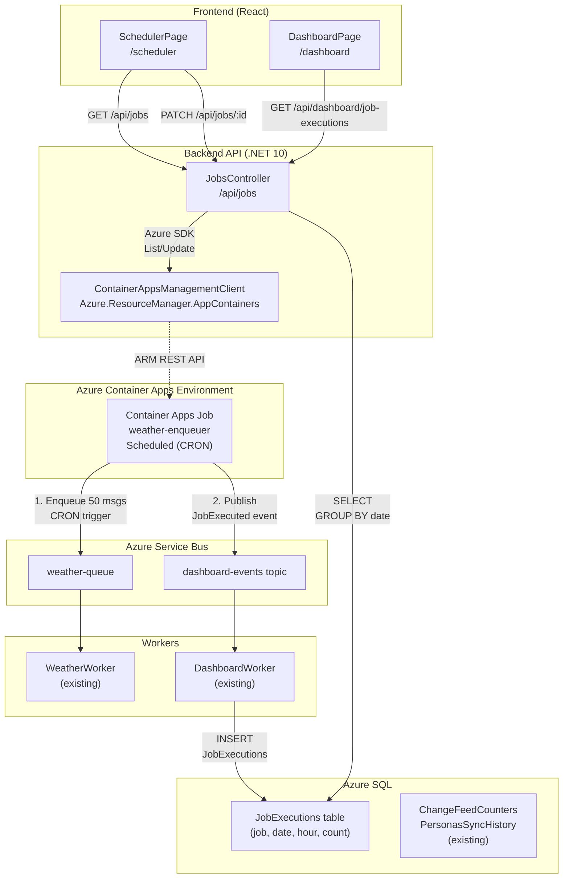

# Container Apps Jobs POC — Scheduler Management & Dashboard Tracking

> **Contexto:** Validar gestión de Container Apps Jobs programados desde el Dashboard con edición de CRON schedules y tracking de ejecuciones.  
> **Prerrequisito:** Dashboard POC completada (Change Feed + contadores SQL + UI).  
> **Estado:** En diseño — revisar antes de implementar.  
> **Repositorio base:** `container-app-poc` (`C:\repos\container-app-poc`)

---

## 0. Objetivo de la POC

Validar el patrón completo de **scheduled Container Apps Jobs gestionados desde el Dashboard**:

1. **Container Job** que reemplaza el tool `ServiceBusEnqueuer` — encola N mensajes periódicamente según CRON
2. **Backend API** con endpoints para listar/editar jobs via Azure Resource Manager SDK
3. **Frontend UI** con página de scheduler para ver jobs y editar su frecuencia
4. **Event tracking** — cada vez que el job se dispara, publica evento al dashboard topic
5. **DashboardWorker** aprende a procesar eventos de tipo `JobExecuted` e incrementa contador
6. **Nueva tabla SQL** `JobExecutions` para almacenar historial (job, fecha, hora, cantidad)
7. **Dashboard UI** muestra nuevo widget "Job Executions" con contadores de ejecuciones

---

## 1. Arquitectura



---

## 2. Requerimientos Funcionales

### 2.1 Container Job `weather-enqueuer`

| Aspecto | Detalle |
|---------|---------|
| **Tipo** | Scheduled (CRON trigger) |
| **Schedule inicial** | `*/5 * * * *` (cada 5 minutos) |
| **Imagen** | `weather-enqueuer:latest` — nuevo proyecto .NET 10 Console App |
| **Lógica** | 1. Leer env var `MESSAGE_COUNT` (default: 50)<br/>2. Encolar `MESSAGE_COUNT` mensajes a `weather-queue` (payload: `{ number, timestamp }`)<br/>3. Publicar evento `JobExecuted` al topic `dashboard-events` con payload: `{ jobName, executedAt, messageCount }` |
| **Secrets** | Service Bus namespace vía `DefaultAzureCredential` (no connection string) |
| **Identity** | User Assigned Managed Identity con roles: `Service Bus Data Sender` |

### 2.2 Backend API — Jobs Management

#### Nuevo Controller: `JobsController`

| Endpoint | Método | Descripción | Roles requeridos |
|----------|--------|-------------|------------------|
| `/api/jobs` | GET | Lista todos los Container Apps Jobs del environment | Admin |
| `/api/jobs/{jobName}` | GET | Obtiene detalles de un job específico (incluye CRON expression) | Admin |
| `/api/jobs/{jobName}/schedule` | PATCH | Actualiza el CRON expression de un scheduled job | Admin |
| `/api/jobs/{jobName}/trigger` | POST | Dispara ejecución manual del job | Admin |
| `/api/dashboard/job-executions` | GET | Devuelve contadores de ejecuciones (últimos 7 días, agrupados por fecha) | Authenticated |

#### NuGets requeridos

```xml
<PackageReference Include="Azure.ResourceManager" Version="1.15.0" />
<PackageReference Include="Azure.ResourceManager.AppContainers" Version="1.4.0" />
```

#### Dependencias de Program.cs

```csharp
// Azure SDK client
builder.Services.AddSingleton<ArmClient>(sp => {
    var credential = new DefaultAzureCredential();
    return new ArmClient(credential);
});
```

### 2.3 Frontend UI — Scheduler Page

Nueva página: `src/frontend/src/pages/SchedulerPage.tsx`

#### Componentes principales

| Componente | Responsabilidad |
|------------|----------------|
| `JobsTable` | Lista de jobs con columnas: Name, Type, Schedule (CRON), Last Run, Status, Actions |
| `CronEditor` | Modal para editar CRON expression con preview de próximas 5 ejecuciones |
| `TriggerButton` | Botón "Execute Now" para disparar job manualmente |

#### UI mockup (shadcn/ui)

```tsx
<Card>
  <CardHeader>
    <CardTitle>Scheduled Jobs</CardTitle>
    <CardDescription>Manage Container Apps Jobs schedules</CardDescription>
  </CardHeader>
  <CardContent>
    <Table>
      <TableHeader>
        <TableRow>
          <TableHead>Name</TableHead>
          <TableHead>Schedule (CRON)</TableHead>
          <TableHead>Last Execution</TableHead>
          <TableHead>Status</TableHead>
          <TableHead>Actions</TableHead>
        </TableRow>
      </TableHeader>
      <TableBody>
        <TableRow>
          <TableCell>weather-enqueuer</TableCell>
          <TableCell>
            <Badge variant="secondary">*/5 * * * *</Badge>
            <span className="text-xs text-muted-foreground ml-2">
              (Every 5 minutes)
            </span>
          </TableCell>
          <TableCell>2026-07-20 14:30:00 UTC</TableCell>
          <TableCell>
            <Badge variant="success">Active</Badge>
          </TableCell>
          <TableCell>
            <Button size="sm" variant="outline" onClick={openCronEditor}>
              Edit Schedule
            </Button>
            <Button size="sm" variant="default" onClick={triggerNow}>
              Execute Now
            </Button>
          </TableCell>
        </TableRow>
      </TableBody>
    </Table>
  </CardContent>
</Card>
```

### 2.4 DashboardWorker — Nuevo Event Type

El worker existente aprende a procesar eventos de tipo `JobExecuted`:

```csharp
public class DashboardEventHandler : IDashboardEventHandler
{
    public async Task HandleEventAsync(DashboardEvent evt, CancellationToken ct)
    {
        return evt.EventType switch
        {
            "ChangeFeedProcessed" => await IncrementChangeFeedCounter(evt, ct),
            "JobExecuted" => await IncrementJobExecutionCounter(evt, ct), // NEW
            _ => Task.CompletedTask
        };
    }

    private async Task IncrementJobExecutionCounter(DashboardEvent evt, CancellationToken ct)
    {
        // evt.Properties: { jobName, executedAt, messageCount }
        var jobName = evt.Properties["jobName"];
        var executedAt = DateTime.Parse(evt.Properties["executedAt"]);
        var date = DateOnly.FromDateTime(executedAt);
        var hour = executedAt.Hour;

        // INSERT or UPDATE JobExecutions table
        await _dbContext.UpsertJobExecutionAsync(jobName, date, hour, ct);
    }
}
```

### 2.5 Nueva tabla SQL — `JobExecutions`

**Patrón:** ID sintético autoincremental + unique index en parte de negocio (similar a ChangeFeedCounters)

```sql
CREATE TABLE [dbo].[JobExecutions] (
    [Id] INT IDENTITY(1,1) NOT NULL,
    [JobName] NVARCHAR(100) NOT NULL,
    [Date] DATE NOT NULL,
    [Hour] INT NOT NULL CHECK ([Hour] >= 0 AND [Hour] <= 23),
    [ExecutionCount] INT NOT NULL DEFAULT 0,
    [UpdatedAt] DATETIME2 NOT NULL DEFAULT GETUTCDATE(),
    CONSTRAINT [PK_JobExecutions] PRIMARY KEY CLUSTERED ([Id]),
    CONSTRAINT [UQ_JobExecutions_JobName_Date_Hour] UNIQUE ([JobName], [Date], [Hour])
);

CREATE INDEX [IX_JobExecutions_Date_JobName] ON [dbo].[JobExecutions] ([Date] DESC, [JobName]);
```

#### Patrón de incremento (similar a `ChangeFeedCounters`)

**Nota:** Entity Framework requiere la property `Id` en el modelo para mapear el identity autoincremental.

```csharp
public class JobExecution
{
    public int Id { get; set; }  // Identity(1,1)
    public required string JobName { get; set; }
    public DateOnly Date { get; set; }
    public int Hour { get; set; }
    public int ExecutionCount { get; set; }
    public DateTime UpdatedAt { get; set; }
}

public async Task UpsertJobExecutionAsync(string jobName, DateOnly date, int hour, CancellationToken ct)
{
    var existing = await _context.JobExecutions
        .FirstOrDefaultAsync(x => x.JobName == jobName && x.Date == date && x.Hour == hour, ct);

    if (existing != null)
    {
        existing.ExecutionCount++;
        existing.UpdatedAt = DateTime.UtcNow;
    }
    else
    {
        _context.JobExecutions.Add(new JobExecution
        {
            JobName = jobName,
            Date = date,
            Hour = hour,
            ExecutionCount = 1,
            UpdatedAt = DateTime.UtcNow
        });
    }

    await _context.SaveChangesAsync(ct);
}
```

### 2.6 Dashboard UI — Job Executions Widget

Nueva sección en `DashboardPage`:

```tsx
<Card>
  <CardHeader>
    <CardTitle>Job Executions (Last 7 Days)</CardTitle>
  </CardHeader>
  <CardContent>
    <Table>
      <TableHeader>
        <TableRow>
          <TableHead>Job Name</TableHead>
          <TableHead>Date</TableHead>
          <TableHead>Total Executions</TableHead>
        </TableRow>
      </TableHeader>
      <TableBody>
        <TableRow>
          <TableCell>weather-enqueuer</TableCell>
          <TableCell>2026-07-20</TableCell>
          <TableCell>288</TableCell> {/* 24h * 12 exec/hour */}
        </TableRow>
        <TableRow>
          <TableCell>weather-enqueuer</TableCell>
          <TableCell>2026-07-19</TableCell>
          <TableCell>288</TableCell>
        </TableRow>
      </TableBody>
    </Table>
  </CardContent>
</Card>
```

---

## 3. Infraestructura (Bicep)

### 3.1 Nuevo módulo: `container-app-job.bicep`

```bicep
param jobName string
param environmentId string
param acrName string
param imageName string
param imageTag string = 'latest'
param cronExpression string = '*/5 * * * *'
param messageCount int = 50
param serviceBusNamespace string
param dashboardTopicName string
param queueName string
param identityId string

resource job 'Microsoft.App/jobs@2024-03-01' = {
  name: jobName
  location: resourceGroup().location
  identity: {
    type: 'UserAssigned'
    userAssignedIdentities: {
      '${identityId}': {}
    }
  }
  properties: {
    environmentId: environmentId
    configuration: {
      scheduleTriggerConfig: {
        cronExpression: cronExpression
        parallelism: 1
        replicaCompletionCount: 1
      }
      replicaTimeout: 600 // 10 minutes
      replicaRetryLimit: 1
      triggerType: 'Schedule'
      registries: [
        {
          server: '${acrName}.azurecr.io'
          identity: identityId
        }
      ]
      secrets: []
    }
    template: {
      containers: [
        {
          name: 'enqueuer'
          image: '${acrName}.azurecr.io/${imageName}:${imageTag}'
          resources: {
            cpu: json('0.25')
            memory: '0.5Gi'
          }
          env: [
            {
              name: 'MESSAGE_COUNT'
              value: string(messageCount)
            }
            {
              name: 'ServiceBus__Namespace'
              value: serviceBusNamespace
            }
            {
              name: 'ServiceBus__QueueName'
              value: queueName
            }
            {
              name: 'ServiceBus__TopicName'
              value: dashboardTopicName
            }
            {
              name: 'JOB_NAME'
              value: jobName
            }
            {
              name: 'AZURE_CLIENT_ID'
              value: reference(identityId, '2023-01-31').clientId
            }
          ]
        }
      ]
    }
  }
}

output jobName string = job.name
output jobId string = job.id
```

### 3.2 Feature flag en `main.bicep`

```bicep
param deployEnqueuerJob bool = true
param enqueuerMessageCount int = 50
param enqueuerCronExpression string = '*/5 * * * *'

module enqueuerJob 'modules/container-app-job.bicep' = if (deployEnqueuerJob) {
  name: 'weather-enqueuer-job'
  params: {
    jobName: '${resourcePrefix}-enqueuer-${env}-${uniqueSuffix}'
    environmentId: containerAppEnvironment.outputs.environmentId
    acrName: containerRegistry.outputs.name
    imageName: 'weather-enqueuer'
    imageTag: 'latest'
    cronExpression: enqueuerCronExpression
    messageCount: enqueuerMessageCount
    serviceBusNamespace: serviceBus.outputs.namespaceFqdn
    dashboardTopicName: 'dashboard-events'
    queueName: 'weather-queue'
    identityId: workerIdentity.outputs.identityId
  }
}
```

### 3.3 RBAC roles requeridos

El job usa la **Worker Identity** existente (ya tiene roles de Service Bus):

✅ `Service Bus Data Sender` — ya asignado en `service-bus.bicep`  
✅ `AcrPull` — ya asignado en `container-registry.bicep`

**No se requieren roles nuevos** — reutilizamos la identity del worker.

---

## 4. Implementación — Orden de Trabajo

### Fase 1: Infraestructura y Job (sin dashboard tracking)

1. ✅ **Migración SQL:** Crear tabla `JobExecutions`
2. ✅ **Backend:** Agregar `JobExecution` entity a `DashboardDbContext`
3. ✅ **Bicep:** Crear módulo `container-app-job.bicep`
4. ✅ **Bicep:** Agregar feature flag `deployEnqueuerJob` en `main.bicep`
5. ✅ **Deploy infra:** `az deployment group create ... --parameters deployEnqueuerJob=true`
6. ✅ **Nuevo proyecto:** `src/jobs/WeatherEnqueuer` (Console App .NET 10)
   - `Program.cs` con `ServiceBusClient` + `DefaultAzureCredential`
   - Leer `MESSAGE_COUNT` env var
   - Encolar mensajes a `weather-queue`
   - Publicar evento `JobExecuted` al topic `dashboard-events`
7. ✅ **Dockerfile:** `src/jobs/WeatherEnqueuer/Dockerfile`
8. ✅ **Build & Push:** `az acr build --registry ... --image weather-enqueuer:latest --file src/jobs/WeatherEnqueuer/Dockerfile src/jobs/WeatherEnqueuer`
9. ✅ **Validar:** Logs del job (`az containerapp job execution logs show`)

### Fase 2: Backend API — Jobs Management

10. ✅ **NuGets:** Agregar `Azure.ResourceManager.AppContainers` al backend
11. ✅ **Program.cs:** Registrar `ArmClient` singleton
12. ✅ **Controlador:** Crear `JobsController` con endpoints:
    - `GET /api/jobs` → lista todos los jobs del environment
    - `GET /api/jobs/{jobName}` → detalles de un job
    - `PATCH /api/jobs/{jobName}/schedule` → actualiza CRON expression
    - `POST /api/jobs/{jobName}/trigger` → dispara ejecución manual
13. ✅ **Rebuild & Redeploy:** Backend
14. ✅ **Validar:** `curl https://.../api/jobs` (debe devolver `weather-enqueuer`)

### Fase 3: Frontend UI — Scheduler Page

15. ✅ **Página nueva:** `src/frontend/src/pages/SchedulerPage.tsx`
    - `useEffect` que llama `GET /api/jobs` y guarda en state
    - Componente `JobsTable` con shadcn/ui `<Table>`
16. ✅ **Modal:** `CronEditorDialog` (shadcn/ui `<Dialog>`)
    - Input para editar CRON expression
    - Preview de próximas ejecuciones (usar `cronstrue` npm package)
    - Botón "Save" que llama `PATCH /api/jobs/{jobName}/schedule`
17. ✅ **Botón:** "Execute Now" → `POST /api/jobs/{jobName}/trigger`
18. ✅ **Router:** Agregar `/scheduler` route en `App.tsx`
19. ✅ **Navbar:** Link a `/scheduler` (solo para Admin)
20. ✅ **Rebuild & Redeploy:** Frontend

### Fase 4: Dashboard Tracking

21. ✅ **DashboardWorker:** Agregar case `"JobExecuted"` en `DashboardEventHandler`
22. ✅ **DbContext:** Método `UpsertJobExecutionAsync`
23. ✅ **Rebuild & Redeploy:** DashboardWorker
24. ✅ **Backend endpoint:** `GET /api/dashboard/job-executions?days=7`
25. ✅ **DashboardPage:** Nuevo widget "Job Executions" que consume el endpoint
26. ✅ **Validar E2E:**
    - Esperar 5 minutos (siguiente ejecución del CRON)
    - Verificar logs del job
    - Verificar logs del DashboardWorker (procesó evento `JobExecuted`)
    - Verificar SQL: `SELECT * FROM JobExecutions`
    - Verificar Dashboard UI: debe mostrar 1 ejecución

---

## 5. API Reference — JobsController

### 5.1 GET /api/jobs

Devuelve lista de todos los Container Apps Jobs en el environment.

**Response:**

```json
[
  {
    "name": "weather-enqueuer",
    "type": "Schedule",
    "cronExpression": "*/5 * * * *",
    "lastExecutionTime": "2026-07-20T14:30:00Z",
    "executionStatus": "Succeeded",
    "messageCount": 50
  }
]
```

### 5.2 PATCH /api/jobs/{jobName}/schedule

Actualiza el CRON expression de un scheduled job.

**Request:**

```json
{
  "cronExpression": "*/10 * * * *"
}
```

**Response:**

```json
{
  "name": "weather-enqueuer",
  "cronExpression": "*/10 * * * *",
  "updated": true
}
```

### 5.3 POST /api/jobs/{jobName}/trigger

Dispara una ejecución manual del job.

**Request:** (empty body)

**Response:**

```json
{
  "name": "weather-enqueuer",
  "executionName": "weather-enqueuer-manual-20260720143045",
  "status": "Started"
}
```

### 5.4 GET /api/dashboard/job-executions?days=7

Devuelve contadores de ejecuciones agrupados por (jobName, date).

**Response:**

```json
{
  "executions": [
    {
      "jobName": "weather-enqueuer",
      "date": "2026-07-20",
      "totalExecutions": 144,
      "hoursWithExecutions": 12
    },
    {
      "jobName": "weather-enqueuer",
      "date": "2026-07-19",
      "totalExecutions": 288,
      "hoursWithExecutions": 24
    }
  ]
}
```

---

## 6. Evento `JobExecuted` — Schema

El job publica este evento al topic `dashboard-events` después de completar el enqueue:

```json
{
  "eventType": "JobExecuted",
  "jobName": "weather-enqueuer",
  "executedAt": "2026-07-20T14:30:00Z",
  "messageCount": 50,
  "queueName": "weather-queue"
}
```

El DashboardWorker lo procesa e incrementa `JobExecutions.ExecutionCount`.

---

## 7. Validación E2E

### Paso 1: Verificar que el job se despliega correctamente

```bash
export RG="rg-far-container-app-easyauth"

# Listar jobs del environment
az containerapp job list -g $RG \
  --query "[].{Name:name, Type:properties.configuration.triggerType, Cron:properties.configuration.scheduleTriggerConfig.cronExpression}" \
  -o table
```

**Salida esperada:**

```
Name                         Type      Cron
---------------------------  --------  -----------
ca-enqueuer-dev-u6qlzs       Schedule  */5 * * * *
```

### Paso 2: Verificar logs de la próxima ejecución

```bash
# Esperar 5 minutos, luego ver logs
az containerapp job execution list -n ca-enqueuer-dev-u6qlzs -g $RG --query "[0].name" -o tsv | \
  xargs -I {} az containerapp job execution logs show -n ca-enqueuer-dev-u6qlzs -g $RG --execution-name {}
```

**Logs esperados:**

```
[INFO] Enqueuing 50 messages to weather-queue...
[INFO] Published event JobExecuted to dashboard-events topic
[INFO] Job completed successfully
```

### Paso 3: Verificar Dashboard procesó el evento

```bash
# Ver logs del DashboardWorker
az containerapp logs show -n ca-dashboard-worker-dev -g $RG --follow

# Buscar línea:
# [INFO] Processing event: JobExecuted (jobName: weather-enqueuer)
# [INFO] Incremented JobExecutions counter
```

### Paso 4: Verificar tabla SQL

```sql
SELECT * FROM JobExecutions
WHERE JobName = 'weather-enqueuer'
  AND Date = CAST(GETUTCDATE() AS DATE)
ORDER BY Hour DESC;
```

**Resultado esperado:**

```
JobName            Date         Hour  ExecutionCount  UpdatedAt
weather-enqueuer   2026-07-20   14    1               2026-07-20 14:30:15
```

### Paso 5: Verificar Frontend

1. Ir a `https://.../scheduler`
2. Ver tabla de jobs — debe mostrar `weather-enqueuer` con CRON `*/5 * * * *`
3. Hacer clic en "Edit Schedule", cambiar a `*/10 * * * *`, guardar
4. Ir a `https://.../dashboard`
5. Ver widget "Job Executions" — debe mostrar 1 ejecución para hoy

---

## 8. Próximos Pasos (Futuros)

- **Múltiples jobs:** Agregar otros scheduled jobs (reportes, limpieza, batch processing)
- **Job templates:** UI para crear jobs dinámicamente desde el Dashboard
- **Execution history:** Endpoint `GET /api/jobs/{jobName}/executions` con últimas 50 ejecuciones
- **Alertas:** Notificación si un job falla consecutivamente 3 veces
- **CRON validation:** Validar expresión CRON en frontend antes de guardar
- **Timezone support:** Permitir editar timezone del CRON (actualmente solo UTC)

---

## 9. Gotchas & Lessons Learned (Pre-Implementation)

1. **Container Apps Jobs usan un namespace ARM diferente** — `Microsoft.App/jobs`, NO `Microsoft.App/containerApps`
2. **CRON expressions son UTC** — todas las ejecuciones programadas son en UTC, no local time
3. **Job executions son efímeros** — se crean pods nuevos en cada ejecución, no son long-running containers
4. **Secrets en jobs** — igual que en container apps, usar Key Vault references vía managed identity
5. **Job trigger manual** — requiere permiso `microsoft.app/jobs/start/action` (incluido en "Container Apps Contributor")
6. **Update CRON via SDK** — requiere `job.Update(patch)` con `ScheduleTriggerConfig.CronExpression` nuevo
7. **Job parallelism** — por default `parallelism=1` (un solo replica por ejecución). Para batch processing alto, aumentar y usar `replicaCompletionCount`
8. **Identity reutilizada** — jobs pueden usar la misma managed identity de workers (no crear identity nueva innecesariamente)
9. **Event ordering** — publicar evento `JobExecuted` DESPUÉS del `SendBatchAsync` (no antes) para garantizar que los mensajes ya están en la queue
10. **Dashboard caching** — endpoint `/api/jobs` puede cachear response 30 segundos (los schedules no cambian frecuentemente)

---

## 10. UI/UX Design Guidelines (shadcn/ui + UX Pro Max Principles)

⚠️ **Nota:** La sección "Container Jobs" en `/health` se agregará en el refactor de health (después de esta POC). Ver [`HEALTH-SERVICE-REFACTOR-ANALYSIS.md`](../../../Users/far/.copilot/session-state/f1bbdf59-b72b-4c8e-baeb-55cbf22ff649/files/HEALTH-SERVICE-REFACTOR-ANALYSIS.md) para detalles.

Esta POC solo cubre:
- ✅ Scheduler Page (`/scheduler`) — gestión de jobs
- ✅ Dashboard Page widget — contadores de ejecuciones

### Scheduler Page — CRON Editor Modal

#### CronEditorDialog Component

**Modal:** shadcn/ui `<Dialog>` with form

**CRON Input:** Use `<Input>` with validation

**Preview:** Show next 5 executions using `cronstrue` npm package

```tsx
<DialogContent className="sm:max-w-md">
  <DialogHeader>
    <DialogTitle>Edit Job Schedule</DialogTitle>
    <DialogDescription>
      Update CRON expression for {jobName}
    </DialogDescription>
  </DialogHeader>
  
  <div className="space-y-4">
    <div>
      <Label htmlFor="cron">CRON Expression</Label>
      <Input 
        id="cron"
        value={cronExpression}
        onChange={handleChange}
        placeholder="*/5 * * * *"
        className="font-mono"
      />
      {error && (
        <p className="text-sm text-destructive mt-1">{error}</p>
      )}
    </div>
    
    <div className="bg-muted p-3 rounded-lg">
      <p className="text-sm font-medium mb-2">Human-readable:</p>
      <p className="text-sm text-muted-foreground">{humanReadable}</p>
    </div>
    
    <div>
      <p className="text-sm font-medium mb-2">Next 5 executions:</p>
      <ul className="text-sm text-muted-foreground space-y-1">
        {nextExecutions.map((time, i) => (
          <li key={i} className="font-mono">{time}</li>
        ))}
      </ul>
    </div>
  </div>
  
  <DialogFooter>
    <Button variant="outline" onClick={onClose}>Cancel</Button>
    <Button onClick={handleSave} disabled={!isValid}>Save</Button>
  </DialogFooter>
</DialogContent>
```

#### Form Validation

**CRITICAL:** Validate CRON before saving

```tsx
const validateCron = (expr: string): boolean => {
  const parts = expr.trim().split(/\s+/);
  return parts.length === 5; // Basic validation
  // TODO: Use cron-validator npm package for full validation
};
```

**Error feedback:** Show near input field (not global toast)

#### Accessibility

- [ ] Form labels with `htmlFor` attribute
- [ ] Error messages with `aria-describedby`
- [ ] Focus trap in modal (shadcn Dialog handles this)
- [ ] Escape key closes modal
- [ ] Focus returns to trigger button on close

---

## 11. Implementation Plan (SQL Todos)

Plan completo con dependencias. Ejecutar en orden de "ready" (sin dependencias pendientes).

### ⚠️ Health Service Refactor — Decisión

**Situación:** El `InfrastructureHealthService` actual usa HTTP directo con ARM REST API (80 líneas manuales). El SDK de Azure Resource Manager (`Azure.ResourceManager.AppContainers`) puede simplificarlo a ~30 líneas y habilitar Container Jobs discovery.

**Decisión:** **Hacer refactor DESPUÉS de Jobs POC** (Opción B)

**Razones:**
1. ✅ **Risk mitigation:** Health es critical path — mejor no tocarlo en POC inicial
2. ✅ **Incremental validation:** Validamos SDK funciona en `JobsController` antes de refactorizar health
3. ✅ **Faster delivery:** 24 todos (no 29) → deployment.md listo más rápido
4. ✅ **Separate concerns:** Jobs POC (feature) vs Health refactor (tech debt) son dos PRs diferentes

**Jobs POC actual:**
- `JobsController` usará SDK (`ArmClient`)
- `InfrastructureHealthService` sigue con HTTP directo (NO cambia)
- Health page NO mostrará jobs hasta el refactor

**Próximo paso (después de Jobs POC):**
- Branch `refactor/health-service-sdk`
- 5 todos: NuGets, refactor apps, refactor replicas, cleanup, tests
- Agregar Container Jobs a health en el mismo refactor
- PR independiente con canary testing

**Documentación:** Ver [`HEALTH-SERVICE-REFACTOR-ANALYSIS.md`](../../../Users/far/.copilot/session-state/f1bbdf59-b72b-4c8e-baeb-55cbf22ff649/files/HEALTH-SERVICE-REFACTOR-ANALYSIS.md) para análisis completo y todos futuros.

---

### Query para ver próximo trabajo:

```sql
SELECT t.id, t.title, t.description, t.status
FROM todos t
WHERE t.status = 'pending'
AND NOT EXISTS (
    SELECT 1 FROM todo_deps td
    JOIN todos dep ON td.depends_on = dep.id
    WHERE td.todo_id = t.id AND dep.status != 'done'
)
ORDER BY t.id;
```

### Fases de implementación:

**Fase 1: Backend Foundation** (6 todos)
1. `jobs-backend-sdk-nugets` — Instalar NuGets Azure.ResourceManager
2. `jobs-health-backend-types` — Definir tipos ContainerJobStatus
3. `jobs-health-backend-sdk` — Implementar consulta via ARM SDK
4. `jobs-backend-controller` — Crear JobsController
5. `jobs-sql-migration` — Crear tabla JobExecutions
6. `jobs-dashboard-handler` — Handler JobExecuted en DashboardWorker
7. `jobs-dashboard-api` — Endpoint /api/dashboard/job-executions

**Fase 2: Container Job** (4 todos)
1. `jobs-enqueuer-project` — Crear Console App WeatherEnqueuer
2. `jobs-enqueuer-dockerfile` — Dockerfile multi-stage
3. `jobs-bicep-module` — Módulo container-app-job.bicep
4. `jobs-bicep-main` — Feature flag en main.bicep

**Fase 3: Frontend** (6 todos)
1. `jobs-health-frontend-types` — Tipos en HealthPage ⚠️ **SKIP — se hará en refactor health**
2. `jobs-health-frontend-ui` — Card Container Jobs en /health ⚠️ **SKIP — se hará en refactor health**
3. `jobs-frontend-scheduler-page` — SchedulerPage con tabla
4. `jobs-frontend-cron-editor` — CronEditorDialog modal
5. `jobs-frontend-router` — Ruta /scheduler
6. `jobs-dashboard-widget` — Widget en DashboardPage

**Nota:** Los todos `jobs-health-frontend-*` están en pending pero **NO se ejecutarán** en esta POC. Se harán en el refactor de health (después).

**Fase 4: Deployment** (8 todos)
1. `jobs-deploy-infra` — Deploy Bicep con job
2. `jobs-build-push-enqueuer` — Build imagen WeatherEnqueuer
3. `jobs-build-push-backend` — Rebuild backend
4. `jobs-build-push-frontend` — Rebuild frontend
5. `jobs-build-push-worker` — Rebuild worker
6. `jobs-validate-e2e` — Validación completa
7. `jobs-update-deployment-md` — Actualizar DEPLOYMENT.md

### Total: 24 todos organizados en 4 fases

---

## 12. Referencia

- [Jobs in Azure Container Apps](https://learn.microsoft.com/azure/container-apps/jobs)
- [Container Apps Jobs CLI Reference](https://learn.microsoft.com/cli/azure/containerapp/job)
- [Azure Resource Manager SDK for .NET](https://learn.microsoft.com/dotnet/api/overview/azure/resourcemanager-readme)
- [CRON expression format](https://en.wikipedia.org/wiki/Cron)
- [Notificaciones Digitales v2 — Arquitectura](https://github.com/camuzziar/notificaciones-digitales/blob/ndv2/docs/arquitectura-ndv2.md)
- [shadcn/ui Components](https://ui.shadcn.com/docs/components)
- [Lucide React Icons](https://lucide.dev/icons/)
- [WCAG 2.1 Contrast Guidelines](https://www.w3.org/WAI/WCAG21/Understanding/contrast-minimum.html)
