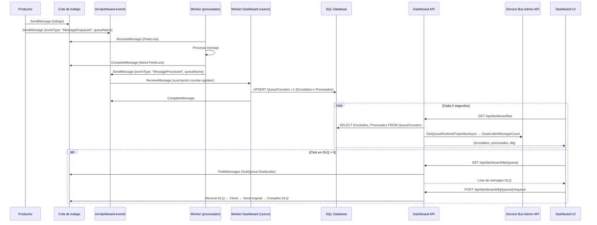
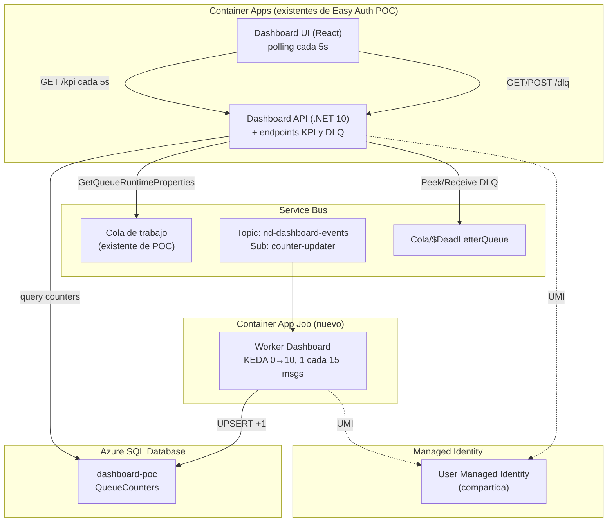

# Dashboard POC — Requerimientos, Diseño e Implementación

> **Contexto:** POC para validar la mecánica de contadores del Dashboard operacional de NDv2.  
> **Prerrequisito:** POC de Easy Auth completada (FE React + BE .NET 10 en Container Apps con Entra ID).  
> **Estado:** En definición — revisar antes de implementar.  
> **Repositorio base:** `container-app-poc` (`C:\repos\container-app-poc`)

---

## 0. Estado actual de la POC (lo que ya existe)

La POC de Easy Auth ya tiene la siguiente estructura sobre la cual se monta el Dashboard:

### Infraestructura desplegada (Bicep)
| Recurso | Módulo | Detalle |
|---|---|---|
| Container App Environment | `container-app-environment.bicep` | Ambiente compartido para todos los apps |
| Container Registry | `container-registry.bicep` | ACR para imágenes |
| User Assigned Managed Identity | `managed-identity.bicep` | Ya tiene roles: `Service Bus Data Receiver` + `Service Bus Data Sender` + `AcrPull` |
| Service Bus namespace (Standard) | `service-bus.bicep` | Queue `weather-jobs` con DLQ, lockDuration 5min, maxDeliveryCount 3 |
| Application Insights | `application-insights.bicep` | Ya configurado y funcionando |
| Log Analytics | `log-analytics.bicep` | Workspace para Container Apps |
| Frontend Container App | `frontend-container-app.bicep` | React + Vite + nginx |
| Backend Container App | `backend-container-app.bicep` | .NET 10 API |
| Worker Container App | `worker-container-app.bicep` | .NET 10 Worker con KEDA scaler |

### Backend (`src/backend/WeatherApi`)
- .NET 10, `net10.0`
- OpenTelemetry + Azure Monitor **ya configurado** (`UseAzureMonitor()`)
- Endpoint `/health` básico ya existe (devuelve `{ status: "healthy", timestamp }`)
- Controllers: `WeatherController`, `AuthController`
- Easy Auth con roles (`[RequireRole("Admin")]`)
- CORS configurado
- **No tiene:** SQL Database, ServiceBusAdministrationClient, endpoints de dashboard

### Worker (`src/worker/WeatherWorker`)
- .NET 10 Worker Service con `BackgroundService`
- `ServiceBusProcessor` con PeekLock (`AutoCompleteMessages = false`)
- OpenTelemetry + Azure Monitor **ya configurado** + `ActivitySource` habilitado
- `CancellationToken` ya se propaga en handlers ✅
- Graceful shutdown con `StopAsync` que drena mensajes en vuelo ✅
- Message dispatch pattern: `MessageDispatcher` → `IMessageHandler`
- DLQ simulation handlers ya existen (exception, validation failure, lock timeout)
- Queue: `weather-jobs`
- Config via Options pattern (`ServiceBusOptions`, `WorkerOptions`)

### Productor/Enqueuer (`src/tools/ServiceBusEnqueuer`)
- Console app que envía N mensajes a `weather-jobs`
- Payload: `{ number, timestamp }`
- Usa `DefaultAzureCredential`
- **No tiene:** processType, publicación al topic de dashboard

### Frontend (`src/frontend`)
- React 18 + TypeScript + Vite + Tailwind CSS
- Application Insights client **ya configurado** (`appInsights.ts`)
- Auth context con Easy Auth
- `useApi` hook para fetch con Bearer token
- Router: `/` (HomePage), `/admin` (AdminPage con ProtectedRoute)
- Navbar con links dinámicos según roles
- **No tiene:** páginas de Dashboard/KPI/DLQ/Health

### Lo que falta agregar (delta para Dashboard POC)
| Categoría | Nuevo |
|---|---|
| **Infraestructura** | Azure SQL Database + topic `nd-dashboard-events` + suscripción + roles `Data Owner` en UMI |
| **Backend** | NuGets: `Microsoft.Data.SqlClient`, `Azure.Messaging.ServiceBus` (admin client). Controllers: `DashboardController`. Health checks: `AddHealthChecks()` con SQL + SB |
| **Worker Dashboard** | Nuevo proyecto `src/worker/DashboardWorker` — consume topic subscription |
| **Enqueuer** | Agregar `processType` random + publicar al topic |
| **Worker existente** | Publicar `MessageProcessed` al topic después del `CompleteMessageAsync` |
| **Frontend** | Nuevas pages: `DashboardPage`, `DlqManagerPage`, `HealthPage`. Links en Navbar. |

---

## 1. Objetivo de la POC

Validar el pipeline completo de eventos del Dashboard:

```
Productor encola mensaje → publica evento al Topic → Worker incrementa contador en SQL → Dashboard muestra KPIs en tiempo real
```

Además, validar la gestión de DLQ desde el Dashboard (inspeccionar, re-encolar, descartar).

---

## 1.1 Concepto de Verticales y Modelos de Acumulación

### Contexto: NDv2 tiene 3 verticales

En producción (NDv2), el sistema maneja 3 verticales independientes que comparten infraestructura pero acumulan contadores de manera diferente:

| Vertical | Trigger | Agrupación de contadores | Ejemplo |
|----------|---------|--------------------------|---------|
| **Genéricos** | Request individual (real-time) | `tipoProceso + fecha` | recupero-clave, 2026-07-10 |
| **Negocio** | Timer CRON diario (batch) | `loteId + tipoProceso` | lote-uuid + aviso-deuda |
| **Campañas** | Operador programa ejecución | `loteId + tipoProceso` (cada campaña = un lote) | lote-uuid + campaña-factura-digital |

**Diferencia clave de acumulación:**
- **Genéricos**: No tienen lote — cada comunicación es independiente. Los contadores se agrupan por `tipoProceso + fecha` (cuántos recuperos de clave se enviaron hoy).
- **Negocio/Campañas**: Se organizan en lotes. Los contadores se agrupan por `loteId + tipoProceso` (cuántas del aviso-deuda de este lote se enviaron). Un lote "converge" cuando `Entregadas + Rebotadas ≈ Enviadas`.

### Cómo lo modelamos en la POC

Un solo Dashboard atiende a todas las verticales. En la POC simulamos con **una vertical ficticia** (`Vertical1`) para validar la mecánica:

| Campo en el evento | Qué representa | Valores en la POC |
|---|---|---|
| `vertical` | A qué vertical pertenece el evento | `"Vertical1"` (fijo en la POC) |
| `processType` | Tipo de proceso dentro de la vertical | `"weather1"` o `"weather2"` (aleatorio) |
| `queueName` | Cola de origen | `"weather-jobs"` |
| `loteId` | (solo negocio/campañas) ID del lote | `null` en la POC (simula genéricos por fecha) |

### Modelos de acumulación en la POC

Para demostrar que el mismo Dashboard soporta ambos modelos:

1. **Modo Genéricos** (default): Contadores por `queueName + processType + fecha`
   - Simula el caso real de genéricos (recupero-clave por día)
   - Es lo que ya tiene el `QueueCounters` actual

2. **Modo Negocio** (futuro): Contadores por `loteId + processType`
   - Se agrega cuando se implemente la simulación de lotes
   - Tabla separada: `LoteCounters`

**En esta iteración de la POC nos enfocamos en el modo Genéricos** (por fecha), que es suficiente para validar el pipeline completo.

---

## 2. Requerimientos funcionales

### 2.1 Pantalla KPI (nueva, accesible desde Home)

- Mostrar contadores **por vertical + cola + tipo de proceso + día**:
  - **Encolados**: cantidad de mensajes que entraron a la cola
  - **Procesados**: cantidad de mensajes completados exitosamente
  - **En DLQ**: cantidad de mensajes en la Dead Letter Queue
- Refresh automático cada **5 segundos** (configurable, en prod será mayor)
- Una fila por combinación de vertical + cola + tipo de proceso, para el día de hoy
- Los genéricos se agrupan por **vertical + tipo de proceso** (`processType`) por día
- En la POC el generador hardcodea `vertical = "Vertical1"` y asigna aleatoriamente `processType = "weather1"` o `"weather2"` a cada mensaje, simulando un caso real donde distintos procesos comparten la misma cola
- Las colas no son dinámicas por configuración — cada cola tiene su tabla en SQL

### 2.2 Vista DLQ Manager (click en el contador DLQ)

- Listar todos los mensajes en la DLQ de la cola seleccionada
- Por cada mensaje mostrar:
  - `MessageId`
  - `DeadLetterReason`
  - `DeadLetterErrorDescription`
  - `EnqueuedTimeUtc`
  - Body del mensaje (JSON)
- **Acciones por mensaje:**
  - **Re-encolar (con edición opcional)**: Clona el mensaje, presenta el body JSON al usuario en un editor. El usuario puede modificarlo o dejarlo tal cual. Al confirmar, se envía a la cola original y se elimina de la DLQ.
  - **Descartar**: Completa el mensaje en DLQ (se elimina)
- **Acción masiva:**
  - Re-encolar todos (sin edición — se re-envían tal cual)
  - Descartar todos

### 2.3 Generación de eventos

- El **productor** (generador existente de la POC) al encolar un mensaje en la cola de trabajo:
  1. Hardcodea `vertical = "Vertical1"` y asigna un `processType` aleatorio (`"weather1"` o `"weather2"`) al mensaje de trabajo (como property o dentro del body)
  2. Publica un evento `MessageEnqueued` al **topic `nd-dashboard-events`** incluyendo `vertical`, `queueName` y `processType`
- El **worker existente**, después de procesar exitosamente un mensaje y **después de completar el PeekLock**, publica un evento `MessageProcessed` al topic incluyendo `vertical` y `processType` que traía el mensaje original
- Los eventos son **fire-and-forget** — si el topic no está disponible, el worker no falla

### 2.4 Worker de Dashboard (nuevo)

- Nuevo Container App Job que consume la suscripción `counter-updater` del topic `nd-dashboard-events`
- Toma cada evento y hace `+1` en la tabla SQL correspondiente para la **vertical + cola + tipo de proceso + día de hoy**
- Escala de **0 a 10 réplicas**, con **1 réplica cada 15 mensajes** pendientes en la suscripción

### 2.5 Contador de DLQ

El contador de DLQ **no se alimenta del topic** — los mensajes van a DLQ por fallo, y no hay garantía de que el worker pueda publicar un evento cuando falla. Se usa la API de administración de Service Bus:

- La **API del Dashboard (BE)** en cada request de polling (cada 5 segundos desde el frontend):
  1. Consulta **SQL Database** para obtener contadores de encolados/procesados
  2. Consulta **Service Bus Management API** (`ServiceBusAdministrationClient.GetQueueRuntimePropertiesAsync()`) para obtener `DeadLetterMessageCount` en tiempo real
  3. Responde al frontend con los tres valores combinados
- Para acceder al Service Bus Management API, la API de BE necesita la **User Assigned Managed Identity** con el rol `Azure Service Bus Data Owner` asignado sobre el namespace de Service Bus
- No depende de eventos — es un query directo en cada polling

> **Referencia:** [QueueRuntimeProperties.DeadLetterMessageCount](https://learn.microsoft.com/dotnet/api/azure.messaging.servicebus.administration.queueruntimeproperties.deadlettermessagecount)
>
> **Best practice de Microsoft:** El conteo de DLQ se obtiene de la API de administración, no de eventos. Los mensajes llegan a DLQ por `MaxDeliveryCount` superado, TTL expirado, o dead-letter explícito del worker — en todos los casos el worker puede no estar en condiciones de publicar un evento.
>
> Ref: [Overview of Service Bus dead-letter queues](https://learn.microsoft.com/azure/service-bus-messaging/service-bus-dead-letter-queues)

---

## 3. Requerimientos de infraestructura

### 3.1 SQL Database

- Crear un **Azure SQL Database** (no Managed Instance — es una POC, SQL Database es más simple y barato)
- Acceso **por User Assigned Managed Identity** — sin connection strings con password
- Agregar el usuario de deploy como **administrador de Entra ID** del SQL Server
- Sin acceso público — Private Endpoint o firewall rules según la VNet de la POC

**Conexión desde .NET:**

```csharp
// Connection string sin password — autenticación por Managed Identity
"Server=tcp:<server>.database.windows.net,1433;Database=dashboard-poc;Authentication=Active Directory Default;User Id=<client-id-de-la-UMI>;Encrypt=True;TrustServerCertificate=False;"
```

> **Referencia:** [Connect to Azure SQL with Microsoft Entra authentication and SqlClient](https://learn.microsoft.com/sql/connect/ado-net/sql/azure-active-directory-authentication)
>
> Con `Authentication=Active Directory Default` y `User Id=<client-id>`, SqlClient usa `DefaultAzureCredential` con la User Managed Identity especificada. En desarrollo local usa las credenciales de Visual Studio / Azure CLI.

**⚠️ Paso manual post-deploy (no automatizable en Bicep):**

Después del deploy de la infra (Bicep crea el SQL Server con Entra ID admin), hay que mapear la UAMI como usuario SQL. Conectarse con el admin de Entra ID y ejecutar:

```sql
-- Mapear la User Assigned Managed Identity como usuario de la DB
CREATE USER [id-weather-worker-dev] FROM EXTERNAL PROVIDER;

-- Permisos para el API (lectura de contadores)
ALTER ROLE db_datareader ADD MEMBER [id-weather-worker-dev];

-- Permisos para el Worker Dashboard (escritura de contadores)
ALTER ROLE db_datawriter ADD MEMBER [id-weather-worker-dev];
```

> **Requisito:** El SQL Server debe tener un Entra ID administrator configurado (puede ser tu usuario de deploy). Solo un usuario con ese rol puede ejecutar `CREATE USER ... FROM EXTERNAL PROVIDER`.

### 3.2 Service Bus — Topic de Dashboard

- Crear topic: **`nd-dashboard-events`**
- Crear suscripción: **`counter-updater`**
- La suscripción recibe todos los mensajes (sin filtro por ahora)
- Configuración del topic:
  - `DefaultMessageTimeToLive`: 1 día (los eventos son transitorios)
  - `MaxSizeInMegabytes`: 1024 (1 GB)
- Configuración de la suscripción:
  - `MaxDeliveryCount`: 5
  - `LockDuration`: 30 segundos (el +1 en SQL es rápido)
  - `DeadLetteringOnMessageExpiration`: true

### 3.3 Worker de Dashboard (nuevo Container App Job)

- **Imagen:** Mismo repo, nuevo proyecto `WorkerDashboard`
- **Trigger:** KEDA Azure Service Bus Topic Subscription scaler
- **Scaling:** min 0, max 10, 1 réplica cada 15 mensajes
- **Acceso:** User Managed Identity para Service Bus y SQL Database
- **Configuración KEDA:**

```yaml
scale:
  minExecutions: 0
  maxExecutions: 10
  pollingInterval: 15
  rules:
    - name: dashboard-events-scaler
      type: azure-servicebus
      metadata:
        topicName: nd-dashboard-events
        subscriptionName: counter-updater
        namespace: <service-bus-namespace-name>  # Solo el nombre, sin .servicebus.windows.net
        messageCount: "15"
      identity: <managed-identity-resource-id>  # KEDA usa MI directamente (no secretRef)
```

> **Nota:** El campo `namespace` solo lleva el nombre (e.g., `sb-weather-dev-u6qlzs`), no el FQDN. KEDA agrega `.servicebus.windows.net` automáticamente. El campo `identity` toma el resource ID completo de la User Assigned Managed Identity.

> **Referencia:** [Set scaling rules in Azure Container Apps](https://learn.microsoft.com/azure/container-apps/scale-app)

### 3.4 Managed Identity

Todos los componentes acceden por **User Assigned Managed Identity (UAMI)**.

> **Modelo de asignación (validado con Microsoft docs):**
>
> - Una **misma UAMI puede asignarse a múltiples recursos** (Container Apps, VMs, etc.) — su ciclo de vida está desacoplado de los recursos.
> - Un **recurso puede tener múltiples UAMI asignadas** — los permisos efectivos son la **unión (sumatoria)** de los roles de todas las identidades asignadas.
> - Esto permite reutilizar una UAMI que ya tiene permisos sobre Service Bus y SQL, asignándola a nuevos Container Apps sin crear identidades ni role assignments adicionales.
>
> Ref: [Managed identity best practice recommendations](https://learn.microsoft.com/entra/identity/managed-identities-azure-resources/managed-identities-status)

**Decisión para la POC:** Reutilizar la misma UAMI de la POC de Easy Auth. Si ya tiene roles sobre Service Bus o SQL, los nuevos Container Apps que la tengan asignada heredan esos permisos automáticamente. Solo se agregan roles faltantes.

| Componente | Accede a | Rol requerido |
|---|---|---|
| API (BE) | SQL Database | Mapped user con `db_datareader` |
| API (BE) | Service Bus (Management API para DLQ count + peek) | `Azure Service Bus Data Owner` |
| API (BE) | Service Bus (DLQ receive/send para re-encolar) | `Azure Service Bus Data Owner` |
| Worker Dashboard | Service Bus (topic subscription) | `Azure Service Bus Data Receiver` |
| Worker Dashboard | SQL Database | Mapped user con `db_datawriter` |
| Productor (generador) | Service Bus (topic send) | `Azure Service Bus Data Sender` |
| Worker existente (procesador) | Service Bus (topic send) | `Azure Service Bus Data Sender` |

> **Nota:** El API (BE) necesita `Data Owner` porque requiere tanto operaciones de administración (runtime properties) como operaciones de datos (receive/send en la DLQ). Los workers solo necesitan el rol mínimo para su función.

---

## 4. Modelo de datos (SQL)

### 4.1 QueueCounters — Modo Genéricos (por fecha)

```sql
-- Contadores por vertical + cola + tipo de proceso + día
-- Cada combinación genera una fila por día
CREATE TABLE dbo.QueueCounters (
    Id INT IDENTITY(1,1) PRIMARY KEY,
    Vertical NVARCHAR(50) NOT NULL,
    QueueName NVARCHAR(100) NOT NULL,
    ProcessType NVARCHAR(100) NOT NULL,
    Fecha DATE NOT NULL DEFAULT CAST(GETUTCDATE() AS DATE),
    Encolados INT NOT NULL DEFAULT 0,
    Procesados INT NOT NULL DEFAULT 0,
    CONSTRAINT UQ_QueueCounters UNIQUE (Vertical, QueueName, ProcessType, Fecha)
);

-- Índice para la query principal del dashboard
CREATE NONCLUSTERED INDEX IX_QueueCounters_Fecha
ON dbo.QueueCounters (Fecha, Vertical, QueueName, ProcessType)
INCLUDE (Encolados, Procesados);
```

### 4.2 LoteCounters — Modo Negocio (por loteId) — Futuro

```sql
-- Contadores por lote + tipo de proceso (Negocio y Campañas)
-- Se crea al publicar NuevoLote, se incrementa con cada evento
CREATE TABLE dbo.LoteCounters (
    Id INT IDENTITY(1,1) PRIMARY KEY,
    Vertical NVARCHAR(50) NOT NULL,
    LoteId NVARCHAR(100) NOT NULL,
    ProcessType NVARCHAR(100) NOT NULL,
    FechaCreacion DATE NOT NULL DEFAULT CAST(GETUTCDATE() AS DATE),
    Creadas INT NOT NULL DEFAULT 0,
    Enviadas INT NOT NULL DEFAULT 0,
    Entregadas INT NOT NULL DEFAULT 0,
    Rebotadas INT NOT NULL DEFAULT 0,
    CONSTRAINT UQ_LoteCounters UNIQUE (LoteId, ProcessType)
);
```

> **Nota:** En esta iteración de la POC solo implementamos `QueueCounters`. `LoteCounters` queda documentado como referencia para cuando se agregue la simulación de lotes (modo Negocio).

**Notas:**
- La granularidad de genéricos es **vertical + cola + tipo de proceso + día** — en la POC veremos filas como `(Vertical1, weather-jobs, weather1, 2026-07-10)`
- No hay columna `DLQ` — ese dato se obtiene en tiempo real del Service Bus Management API
- El Worker de Dashboard hace `UPSERT` (INSERT si no existe la fila, UPDATE +1 si existe)
- La fecha se deriva del `EnqueuedTimeUtc` del mensaje del topic (consistente con el doc de arquitectura)
- El campo `Vertical` permite que el Dashboard filtre/agrupe por vertical

**UPSERT del worker (concurrency-safe, sin MERGE):**

> **Best practice:** Se evita `MERGE` en escenarios de alta concurrencia por riesgo de deadlocks ([Microsoft docs](https://learn.microsoft.com/sql/t-sql/statements/merge-transact-sql#remarks)). Se usa el patrón UPDATE-first + INSERT con TRY/CATCH, que es más simple y más seguro con múltiples réplicas concurrentes.

```sql
-- Patrón atómico: UPDATE primero (la mayoría de las veces la fila ya existe)
UPDATE dbo.QueueCounters
SET Encolados = Encolados + @DeltaEncolados,
    Procesados = Procesados + @DeltaProcesados
WHERE Vertical = @Vertical
  AND QueueName = @QueueName
  AND ProcessType = @ProcessType
  AND Fecha = @Fecha;

-- Si no existía la fila (primer evento del día para esa combinación)
IF @@ROWCOUNT = 0
BEGIN
    BEGIN TRY
        INSERT INTO dbo.QueueCounters (Vertical, QueueName, ProcessType, Fecha, Encolados, Procesados)
        VALUES (@Vertical, @QueueName, @ProcessType, @Fecha, @DeltaEncolados, @DeltaProcesados);
    END TRY
    BEGIN CATCH
        -- Race condition: otra réplica insertó entre el UPDATE y el INSERT
        IF ERROR_NUMBER() = 2627 -- Unique constraint violation
            UPDATE dbo.QueueCounters
            SET Encolados = Encolados + @DeltaEncolados,
                Procesados = Procesados + @DeltaProcesados
            WHERE Vertical = @Vertical
              AND QueueName = @QueueName
              AND ProcessType = @ProcessType
              AND Fecha = @Fecha;
    END CATCH
END
```

**¿Por qué funciona sin locks explícitos?**
- `UPDATE SET col = col + 1` es atómico a nivel de fila en SQL Server (toma U-lock → X-lock)
- Múltiples réplicas haciendo `UPDATE +1` en la misma fila se serializan naturalmente sin deadlocks
- El INSERT solo ocurre una vez al día por combinación — la race condition se maneja con TRY/CATCH
- No se necesita `HOLDLOCK`, `SERIALIZABLE`, ni `sp_getapplock`

---

## 5. Eventos del Topic

### Formato del mensaje

```json
{
  "eventType": "MessageEnqueued | MessageProcessed",
  "vertical": "Vertical1",
  "queueName": "weather-jobs",
  "processType": "weather1",
  "loteId": null,
  "timestamp": "2026-07-10T12:00:00Z"
}
```

- `eventType` como **Application Property** del mensaje de Service Bus (permite filtros futuros en suscripciones)
- `vertical` identifica la vertical de origen (en la POC: `"Vertical1"` fijo; en prod: `"Genericos"`, `"Negocio"`, `"Campanas"`)
- `queueName` identifica la cola de origen
- `processType` identifica el tipo de proceso dentro de esa vertical (en la POC: `"weather1"` o `"weather2"`)
- `loteId` (nullable) — solo presente para Negocio/Campañas. Si es `null`, los contadores se acumulan por `processType + fecha` (modo genéricos)
- `timestamp` es informativo; la fecha para los contadores se toma del `EnqueuedTimeUtc` del broker

**Regla de acumulación en el Worker Dashboard:**
- Si `loteId != null` → acumula en tabla `LoteCounters` por `loteId + processType`
- Si `loteId == null` → acumula en tabla `QueueCounters` por `queueName + processType + fecha`

### Quién publica y cuándo

| Momento | Quién publica | Evento | Cuándo exactamente |
|---|---|---|---|
| Al encolar trabajo | Productor (generador) | `MessageEnqueued` | Después de `sender.SendMessageAsync()` exitoso a la cola de trabajo |
| Al completar trabajo | Worker (procesador) | `MessageProcessed` | Después de `receiver.CompleteMessageAsync()` — cuando el PeekLock se libera |

> **Importante:** El evento `MessageProcessed` se publica **después** del `CompleteMessageAsync`, no antes. Esto garantiza que solo se cuenta como procesado un mensaje que realmente fue completado y liberado del lock.

### Publicación fire-and-forget

```csharp
// En el productor, después de encolar el trabajo
var processType = Random.Shared.Next(2) == 0 ? "weather1" : "weather2";
try
{
    await topicSender.SendMessageAsync(new ServiceBusMessage(
        JsonSerializer.Serialize(new {
            eventType = "MessageEnqueued",
            vertical = "Vertical1",
            queueName = "weather-jobs",
            processType,
            loteId = (string?)null
        }))
    {
        ApplicationProperties = { ["eventType"] = "MessageEnqueued", ["vertical"] = "Vertical1" }
    });
}
catch (Exception ex)
{
    // Log warning, no falla el flujo principal
    logger.LogWarning(ex, "No se pudo publicar evento al dashboard topic");
}
```

---

## 6. API del Dashboard (endpoints nuevos)

### KPI

```
GET /api/dashboard/kpi?fecha=2026-07-10&vertical=Vertical1
```

**Response:**
```json
[
  {
    "vertical": "Vertical1",
    "queueName": "weather-jobs",
    "processType": "weather1",
    "fecha": "2026-07-10",
    "encolados": 812,
    "procesados": 800,
    "dlq": 2
  },
  {
    "vertical": "Vertical1",
    "queueName": "weather-jobs",
    "processType": "weather2",
    "fecha": "2026-07-10",
    "encolados": 711,
    "procesados": 700,
    "dlq": 1
  }
]
```

- `encolados` y `procesados` vienen de SQL (`QueueCounters`)
- `dlq` viene del Service Bus Management API en tiempo real:

```csharp
var adminClient = new ServiceBusAdministrationClient(
    "<namespace>.servicebus.windows.net",
    new DefaultAzureCredential(new DefaultAzureCredentialOptions
    {
        ManagedIdentityClientId = "<client-id-umi>"
    }));

var props = await adminClient.GetQueueRuntimePropertiesAsync("nd-poc-queue");
var dlqCount = props.Value.DeadLetterMessageCount;
```

> **Referencia:** [ServiceBusAdministrationClient](https://learn.microsoft.com/dotnet/api/azure.messaging.servicebus.administration.servicebusadministrationclient)

### DLQ Manager

```
GET  /api/dashboard/dlq/{queueName}          → Lista mensajes en DLQ
POST /api/dashboard/dlq/{queueName}/requeue  → Re-encolar mensaje(s)
POST /api/dashboard/dlq/{queueName}/discard  → Descartar mensaje(s)
```

**GET /api/dashboard/dlq/{queueName}**

```json
[
  {
    "messageId": "abc-123",
    "deadLetterReason": "MaxDeliveryCountExceeded",
    "deadLetterErrorDescription": "Timeout connecting to CosmosDB",
    "enqueuedTimeUtc": "2026-07-10T10:30:00Z",
    "body": { "comunicacionId": "com-456", "tipo": "recupero-clave" },
    "sequenceNumber": 42
  }
]
```

**Implementación con el .NET SDK:**

```csharp
// Leer mensajes de la DLQ (peek, no consume)
var dlqReceiver = client.CreateReceiver("nd-poc-queue",
    new ServiceBusReceiverOptions { SubQueue = SubQueue.DeadLetter });

// Peek: ver sin consumir
var messages = await dlqReceiver.PeekMessagesAsync(maxMessages: 50);
```

> **Referencia:** [Receive from dead-letter queue](https://learn.microsoft.com/azure/service-bus-messaging/service-bus-dead-letter-queues)

**POST /api/dashboard/dlq/{queueName}/requeue**

Body:
```json
{
  "sequenceNumber": 42,
  "body": "{ ... }"  // opcional — si viene, reemplaza el body original
}
```

- Si `body` es `null` o no se envía, se re-encola con el body original
- Si `body` tiene contenido, se usa ese como body del nuevo mensaje (el usuario lo editó)

```csharp
// Re-encolar: receive con PeekLock → clone (o crear nuevo con body editado) → send → complete en DLQ
var dlqReceiver = client.CreateReceiver("nd-poc-queue",
    new ServiceBusReceiverOptions
    {
        SubQueue = SubQueue.DeadLetter,
        ReceiveMode = ServiceBusReceiveMode.PeekLock
    });

var sender = client.CreateSender("nd-poc-queue");

// Recibir el mensaje específico de la DLQ
var dlqMsg = await dlqReceiver.ReceiveMessageAsync(
    fromSequenceNumber: sequenceNumber);

// Crear mensaje para re-encolar
ServiceBusMessage resubmit;
if (editedBody is not null)
{
    // El usuario editó el body — crear mensaje nuevo con las properties del original
    resubmit = new ServiceBusMessage(BinaryData.FromString(editedBody));
    foreach (var prop in dlqMsg.ApplicationProperties)
        resubmit.ApplicationProperties.Add(prop.Key, prop.Value);
    resubmit.ContentType = dlqMsg.ContentType;
    resubmit.Subject = dlqMsg.Subject;
}
else
{
    // Sin edición — clonar tal cual
    resubmit = new ServiceBusMessage(dlqMsg);
}

await sender.SendMessageAsync(resubmit);

// Completar en DLQ (lo remueve)
await dlqReceiver.CompleteMessageAsync(dlqMsg);
```

**POST /api/dashboard/dlq/{queueName}/discard** (body: `{ "sequenceNumbers": [44] }`)

```csharp
// Descartar: receive con PeekLock → complete (sin re-enviar)
var dlqMsg = await dlqReceiver.ReceiveMessageAsync(
    fromSequenceNumber: sequenceNumber);
await dlqReceiver.CompleteMessageAsync(dlqMsg);
```

> **Nota de seguridad:** Estas operaciones requieren rol `Azure Service Bus Data Owner` en la UMI del API, porque necesita tanto `Receive` como `Send` sobre la misma entidad.

---

## 7. Frontend — Pantallas

### 7.1 Pantalla KPI (nueva ruta, link desde Home)

| Elemento | Descripción |
|---|---|
| **Título** | "Dashboard — KPIs de Colas" |
| **Tabla** | Una fila por cola + tipo de proceso: QueueName / ProcessType / Encolados / Procesados / DLQ |
| **DLQ clickeable** | El número de DLQ es un link que navega a la vista de DLQ Manager |
| **Auto-refresh** | Polling cada 5 segundos al endpoint `GET /api/dashboard/kpi` |
| **Indicador visual DLQ** | Verde (0), Amarillo (1-10), Rojo (>10) |
| **Fecha** | Muestra datos del día de hoy. Selector de fecha como mejora futura. |
| **DLQ del Dashboard Topic** | Fila adicional mostrando el DeadLetterMessageCount de la suscripción `counter-updater` del topic `nd-dashboard-events`. Clickeable para ver/gestionar esos mensajes DLQ. |

### 7.2 Pantalla Health (nueva, accesible desde Home)

| Elemento | Descripción |
|---|---|
| **Título** | "Estado de componentes" |
| **Panel** | Una card por componente del sistema, mostrando estado (Healthy / Degraded / Unhealthy) |
| **Componentes monitoreados** | API (BE), Worker procesador, Worker Dashboard, SQL Database, Service Bus |
| **Auto-refresh** | Polling cada 30 segundos al endpoint `GET /api/health/components` |
| **Indicador visual** | 🟢 Healthy, 🟡 Degraded, 🔴 Unhealthy |
| **Detalle** | Click en un componente muestra el detalle del check (latencia, último error, etc.) |

### 7.3 Pantalla DLQ Manager (navega desde KPI)

| Elemento | Descripción |
|---|---|
| **Título** | "DLQ — {queueName}" |
| **Tabla** | Lista de mensajes en DLQ con: MessageId, Reason, Description, Fecha, Body (expandible) |
| **Acciones por mensaje** | Botones "Re-encolar" y "Descartar" por fila |
| **Flujo Re-encolar** | Al hacer click en "Re-encolar": se abre un modal/panel con el body JSON del mensaje en un editor de texto (editable). Un aviso indica "Puede modificar el contenido antes de re-encolar, o dejarlo sin cambios". Botón "Confirmar re-encolado" envía con o sin edición. |
| **Acciones masivas** | "Re-encolar todos" (sin edición) y "Descartar todos" en el header |
| **Confirmación** | Modal de confirmación antes de ejecutar acciones masivas |
| **Feedback** | Toast/notificación de éxito/error después de cada acción |

---

## 8. Diagrama de flujo completo



---

## 9. Arquitectura de componentes



---

## 10. Consideraciones técnicas

### 10.1 Idempotencia del Worker Dashboard

**Problema:** Con KEDA escalando a 10 réplicas y PeekLock, si el lock expira antes del `CompleteMessageAsync`, el mensaje se re-entrega y el worker haría `+1` dos veces.

**Análisis:**
- No es viable usar `SequenceNumber` como key de deduplicación porque la generación de eventos es distribuida (productor y worker publican independientemente)
- Guardar todos los `MessageId` (UUID) en una tabla de deduplicación generaría un cuello de botella por lockeo y alto volumen de escrituras concurrentes bajo carga
- No existe un TTL nativo en SQL Server como en CosmosDB, pero se podría implementar con un cleanup periódico (`DELETE WHERE ProcessedAt < DATEADD(hour, -1, GETUTCDATE())`)

**Decisión: Best effort**

Se acepta que es una estadística, no una transacción financiera. Con buen código (PeekLock completado rápidamente), `LockDuration: 30s` apropiado, y la disponibilidad de los servicios de Azure (SLA 99.9%), la probabilidad de un double-count es muy baja. El impacto de un `+1` extra en un contador de miles es despreciable.

**Mitigaciones implementadas (sin tabla de dedup):**
- `LockDuration` de 30 segundos — suficiente para un UPDATE rápido en SQL
- El worker hace la operación mínima (un UPDATE de una fila) — riesgo de timeout mínimo
- Logging: si el worker detecta que está procesando un mensaje con `DeliveryCount > 1`, logea warning para observabilidad
- `MaxDeliveryCount: 5` en la suscripción — si realmente falla, va a DLQ en lugar de re-intentar infinitamente

### 10.2 Observabilidad — Distributed Tracing con OpenTelemetry

El flujo `Productor → Topic → Worker Dashboard → SQL → API → Frontend` es ideal para validar tracing distribuido end-to-end.

**Implementación:**
- El SDK de Azure Service Bus .NET (≥7.5.0) soporta OpenTelemetry via `System.Diagnostics.ActivitySource`
- Se propaga el `Diagnostic-Id` automáticamente en los mensajes de Service Bus
- Cada componente exporta traces a **Application Insights** via OpenTelemetry SDK

**Configuración en cada Container App (.NET 10):**

```csharp
builder.Services.AddOpenTelemetry()
    .WithTracing(tracing =>
    {
        tracing
            .AddAspNetCoreInstrumentation()
            .AddHttpClientInstrumentation()
            .AddSource("Azure.Messaging.ServiceBus") // Service Bus traces
            .AddSqlClientInstrumentation()
            .AddAzureMonitorTraceExporter(o =>
                o.ConnectionString = builder.Configuration["APPLICATIONINSIGHTS_CONNECTION_STRING"]);
    })
    .WithMetrics(metrics =>
    {
        metrics
            .AddAspNetCoreInstrumentation()
            .AddHttpClientInstrumentation()
            .AddAzureMonitorMetricExporter(o =>
                o.ConnectionString = builder.Configuration["APPLICATIONINSIGHTS_CONNECTION_STRING"]);
    });
```

> **Referencia:** [Distributed tracing in Service Bus .NET SDK](https://learn.microsoft.com/azure/service-bus-messaging/service-bus-end-to-end-tracing)

**Qué se valida en la POC:**
- Que un trace inicia en el productor y se puede seguir hasta el Worker Dashboard
- Que el Application Insights muestra la Application Map con todos los componentes
- Que se pueden correlacionar errores (ej: un mensaje en DLQ se puede rastrear hasta el trace original)

### 10.3 DLQ de la suscripción del Topic Dashboard

La suscripción `counter-updater` del topic `nd-dashboard-events` tiene su propia DLQ. Si el Worker Dashboard falla consistentemente (ej: SQL no disponible), los eventos van a esa DLQ.

**Debe ser visible en el Dashboard:**
- El API también consulta `GetSubscriptionRuntimePropertiesAsync("nd-dashboard-events", "counter-updater")` para obtener el `DeadLetterMessageCount` de la suscripción
- Se muestra como una fila adicional en la pantalla KPI: `nd-dashboard-events/counter-updater`
- Es clickeable y lleva al DLQ Manager para gestionar esos mensajes

```csharp
var subProps = await adminClient.GetSubscriptionRuntimePropertiesAsync(
    "nd-dashboard-events", "counter-updater");
var topicDlqCount = subProps.Value.DeadLetterMessageCount;
```

> **Referencia:** [SubscriptionRuntimeProperties](https://learn.microsoft.com/dotnet/api/azure.messaging.servicebus.administration.subscriptionruntimeproperties)

### 10.4 Concurrencia en SQL — Patrón UPDATE-first

Ya documentado en la sección 4 (modelo de datos). Resumen de por qué funciona:

- `UPDATE SET col = col + 1` sobre una fila existente es atómico — SQL Server toma U-lock → X-lock por fila
- Múltiples réplicas concurrentes se serializan naturalmente en el row lock, sin deadlocks
- El INSERT solo ocurre una vez al día (primer evento de cada combinación) — la race condition se maneja con TRY/CATCH
- Se evita `MERGE` que es [propenso a deadlocks en concurrencia](https://learn.microsoft.com/sql/t-sql/statements/merge-transact-sql) según Microsoft docs
- No se necesita `SERIALIZABLE`, `HOLDLOCK`, ni `sp_getapplock` — el row lock nativo es suficiente

### 10.5 Graceful Shutdown y CancellationToken

Cuando KEDA escala de N a 0, Container Apps envía `SIGTERM` con un grace period (default 30s). El worker **debe** respetar el `CancellationToken` para no dejar mensajes en estado "locked".

**Regla: `CancellationToken` en toda la cadena de llamadas.**

```csharp
public async Task ProcessMessageAsync(
    ProcessSessionMessageEventArgs args,
    CancellationToken cancellationToken)
{
    // El token se propaga a TODAS las operaciones
    var command = new SqlCommand(upsertSql, connection);
    await command.ExecuteNonQueryAsync(cancellationToken);

    // Solo completar si no se canceló
    if (!cancellationToken.IsCancellationRequested)
    {
        await args.CompleteMessageAsync(args.Message, cancellationToken);
    }
    // Si se canceló: no completamos → lock expira → Service Bus re-entrega
    // Esto es correcto: preferimos un posible +1 extra a perder un evento
}
```

**Aplicación en todos los componentes:**
- Worker Dashboard: `CancellationToken` en SQL + `CompleteMessageAsync`
- Worker procesador existente: idem
- API (BE): ASP.NET Core pasa `HttpContext.RequestAborted` automáticamente
- Productor: `CancellationToken` en `SendMessageAsync`

> El `IHostApplicationLifetime.ApplicationStopping` de .NET notifica el shutdown — Container Apps hookea `SIGTERM` → `StopAsync` → cancellation token.

### 10.6 Health Checks

ASP.NET Core tiene health checks out-of-the-box. Se agregan para validar dependencias y exponerlos en el Dashboard.

**Setup en el API (BE):**

```csharp
builder.Services.AddHealthChecks()
    .AddSqlServer(
        connectionString: builder.Configuration.GetConnectionString("DashboardDb"),
        name: "sql-database",
        tags: new[] { "db", "ready" })
    .AddAzureServiceBusTopic(
        connectionString: "<sb-connection-or-use-credential>",
        topicName: "nd-dashboard-events",
        name: "servicebus-topic",
        tags: new[] { "messaging", "ready" });

app.MapHealthChecks("/health", new HealthCheckOptions
{
    ResponseWriter = UIResponseWriter.WriteHealthCheckUIResponse
});

app.MapHealthChecks("/health/live", new HealthCheckOptions
{
    Predicate = _ => false // Solo verifica que el proceso está vivo
});

app.MapHealthChecks("/health/ready", new HealthCheckOptions
{
    Predicate = check => check.Tags.Contains("ready")
});
```

**NuGet packages:**
- `AspNetCore.HealthChecks.SqlServer`
- `AspNetCore.HealthChecks.AzureServiceBus`
- `AspNetCore.HealthChecks.UI.Client` (para el response writer)

**Endpoint para el Dashboard UI:**

```
GET /api/health/components
```

Response:
```json
{
  "status": "Healthy",
  "components": [
    { "name": "sql-database", "status": "Healthy", "duration": "00:00:00.023" },
    { "name": "servicebus-topic", "status": "Healthy", "duration": "00:00:00.045" },
    { "name": "worker-dashboard", "status": "Healthy", "lastSeen": "2026-07-10T12:00:05Z" },
    { "name": "worker-procesador", "status": "Degraded", "lastSeen": "2026-07-10T11:55:00Z" }
  ]
}
```

**Health de los Workers (no tienen endpoint HTTP):**
- Cada worker escribe un heartbeat en SQL (tabla `ComponentHealth`) con timestamp
- El API chequea: si `lastSeen` es < 2 minutos → Healthy, < 5 min → Degraded, > 5 min → Unhealthy
- En producción esto podría ser un Container App liveness probe, pero para la POC el heartbeat es suficiente

**Container Apps probes (configuración del deployment):**

```json
{
  "probes": [
    { "type": "liveness", "httpGet": { "path": "/health/live", "port": 8080 } },
    { "type": "readiness", "httpGet": { "path": "/health/ready", "port": 8080 } }
  ]
}
```

> **Referencia:** [Health checks in ASP.NET Core](https://learn.microsoft.com/aspnet/core/host-and-deploy/health-checks)
>
> **Referencia:** [Container Apps health probes](https://learn.microsoft.com/azure/container-apps/health-probes)

---

## 11. Plan de implementación

> **Nota:** Los items marcados con ✅ ya están resueltos por la POC existente (`container-app-poc`). El plan solo lista lo que hay que **agregar o modificar**.

### Directivas de implementación (skills y librerías)

| Área | Skill a invocar | Notas |
|------|-----------------|-------|
| Diseño UI/UX (wireframes, layout, colores, componentes visuales) | `ui-ux-pro-max` | Invocar **antes** de escribir código de frontend para definir diseño |
| Infraestructura Bicep (módulos, resources) | `writing-bicep-templates` + `update-avm-modules-in-bicep` | Invocar para escribir Bicep con best practices y usar Azure Verified Modules |
| Diagramas desde Bicep | `bicep-diagrams` | Para generar diagramas de arquitectura desde los `.bicep` existentes |
| Código .NET (backend, workers) | `microsoft-docs` | Consultar siempre Microsoft Learn para patrones .NET actualizados |
| Código React (frontend) | `vercel-react-best-practices` | Invocar al construir componentes, hooks, páginas |
| Consultas de documentación Azure/.NET | `microsoft-docs` | Invocar **siempre** para validar APIs, configuraciones y patrones |
| Composición de componentes React | `vercel-composition-patterns` | Para layouts, composición avanzada, slot patterns |

**Regla general:** Usar siempre la **última versión disponible** de cada librería/SDK. Verificar en `microsoft-docs` antes de instalar NuGets o npm packages. Si hay una versión preview estable, preferirla sobre la GA anterior.

**Regla de no-regresión:** Después de cada fase, validar que lo existente sigue funcionando. Los recursos actuales (Easy Auth, WeatherWorker, Service Bus queue, KEDA scaling) no deben romperse. Si un cambio en Bicep modifica un recurso existente, hacer `what-if` primero y confirmar que no hay deletes inesperados.

**Librerías target (latest al momento de la POC):**
- .NET 10 (ya en uso)
- `Azure.Messaging.ServiceBus` ≥ 7.18+
- `Microsoft.Data.SqlClient` ≥ 6.0+
- `Azure.Monitor.OpenTelemetry.AspNetCore` ≥ 1.3+
- `Azure.Identity` ≥ 1.13+
- React 19+ (ya en uso)
- `@tanstack/react-query` para data fetching (evaluar vs SWR)
- Tailwind CSS (ya en uso)

### Fase 1 — Infraestructura (Bicep — nuevos módulos en `biceps/modules/`)
> 🔧 Skills: `writing-bicep-templates` para estructura y best practices, `update-avm-modules-in-bicep` para usar Azure Verified Modules, `microsoft-docs` para validar API versions
> ⚠️ **Validación:** Después de cada cambio en Bicep, hacer `az deployment group what-if` y luego deploy. Confirmar que los recursos existentes (Easy Auth, Worker, Service Bus) siguen funcionando.
1. ✅ Crear módulo `sql-database.bicep` — Azure SQL Database + firewall/private endpoint
2. ⏭️ Configurar Entra ID admin (usuario de deploy) en el SQL Server — **MANUAL post-deploy**
3. ⏭️ Mapear la User Assigned Managed Identity existente (`managed-identity.bicep`) como usuario SQL con `db_datareader` + `db_datawriter` — **MANUAL post-deploy**
4. ✅ Crear tablas `dbo.QueueCounters` + `dbo.ComponentHealth` (script SQL versionado en `sql/`)
5. ✅ Agregar topic `nd-dashboard-events` + suscripción `counter-updater` al módulo `service-bus.bicep` existente
6. ✅ Agregar role assignment `Azure Service Bus Data Owner` a la UMI en `managed-identity.bicep` (para el API — admin + DLQ ops)
7. ✅ ~~Crear Application Insights~~ Ya existe (`application-insights.bicep`)
8. ✅ Integrar `sql-database.bicep` en `main.bicep` con parámetro `deployDashboard`

### Fase 2 — Backend (`src/backend/WeatherApi`)
> 🔧 Skill: `microsoft-docs` para APIs de ServiceBusAdministrationClient, SqlClient, Health Checks
8. ✅ Agregar NuGets: `Microsoft.Data.SqlClient`, `Azure.Messaging.ServiceBus` (para `ServiceBusAdministrationClient`)
9. ✅ Crear `Controllers/DashboardController.cs` con endpoint KPI
10. ✅ Implementar `ServiceBusAdministrationClient` para `DeadLetterMessageCount` (queue `weather-jobs` + subscription `counter-updater`)
11. ✅ Implementar operaciones DLQ (peek, requeue con edición opcional, discard) — `DlqManagerController.cs`
12. ✅ Implementar lectura de `QueueCounters` desde SQL con `DefaultAzureCredential`
13. ✅ Reemplazar endpoint `/health` actual por `AddHealthChecks()` con checks de SQL + Service Bus + liveness/readiness separados
14. ✅ Implementar endpoint `/api/health/components` (agrega heartbeat de workers desde `ComponentHealth`)
15. ✅ ~~Configurar OpenTelemetry~~ Ya existe (`UseAzureMonitor()` en Program.cs)

### Fase 3 — Worker Dashboard (nuevo: `src/worker/DashboardWorker`)
> 🔧 Skill: `microsoft-docs` para patrón ServiceBusProcessor con topic subscription
16. ✅ Crear proyecto — mismo patrón que `WeatherWorker`: `BackgroundService` + `ServiceBusProcessor`
17. ✅ Configurar para consumir **topic subscription** (`CreateProcessor("nd-dashboard-events", "counter-updater", ...)`)
18. ✅ Implementar UPSERT concurrency-safe en SQL (patrón UPDATE-first)
19. ✅ Crear módulo Bicep `dashboard-worker-container-app.bicep` con KEDA topic subscription scaler
20. ✅ ~~CancellationToken~~ Seguir mismo patrón del `WeatherWorker` (ya propagado correctamente)
21. ⏭️ Agregar heartbeat a tabla `ComponentHealth` — **DEFERRED** (no crítico para POC inicial)
22. ✅ Configurar OpenTelemetry (`UseAzureMonitor()` + `ActivitySource` — copiar de `WeatherWorker/Program.cs`)
23. ✅ Crear `Dockerfile` (copiar patrón de `src/worker/WeatherWorker/Dockerfile`)

### Fase 4 — Modificar Enqueuer y Worker existentes
> 🔧 Skill: `microsoft-docs` para ServiceBusSender fire-and-forget patterns
24. ✅ **ServiceBusEnqueuer** (`src/tools/ServiceBusEnqueuer/Program.cs`):
    - Agregar `processType` aleatorio (`weather1`/`weather2`) al payload del mensaje
    - Crear `ServiceBusSender` adicional para el topic `nd-dashboard-events`
    - Publicar `MessageEnqueued` fire-and-forget después de cada `SendMessageAsync` a la queue
25. ✅ **WeatherWorker** (`src/worker/WeatherWorker/Handlers/DefaultMessageHandler.cs`):
    - Después del `CompleteMessageAsync` exitoso (línea 21), publicar `MessageProcessed` al topic
    - Agregar `ServiceBusSender` para el topic en DI (`Program.cs`)
    - Fire-and-forget con try/catch (no bloquear el flujo principal)
26. ✅ ~~CancellationToken~~ Ya se propaga correctamente en todos los handlers
27. ⏭️ Agregar heartbeat a `ComponentHealth` en ambos workers (periódico, cada 30s) — **DEFERRED** (no crítico)
28. ✅ ~~OpenTelemetry~~ Ya configurado en `WeatherWorker` con `UseAzureMonitor()` + `ActivitySource`

### Fase 5 — Frontend (`src/frontend`)
> 🎨 Skill: `ui-ux-pro-max` para diseño visual ANTES de codear
> 🔧 Skill: `vercel-react-best-practices` + `vercel-composition-patterns` para implementación
29. ✅ Crear `src/pages/DashboardPage.tsx` — pantalla KPI con polling cada 5 segundos
30. ✅ Incluir DLQ de `weather-jobs` + DLQ de subscription `counter-updater` en la tabla KPI
31. ✅ Crear `src/pages/DlqManagerPage.tsx` — gestión DLQ con edición opcional al re-encolar
32. ✅ Crear `src/pages/HealthPage.tsx` — estado de componentes (polling cada 30s)
33. ✅ Agregar rutas en `App.tsx`: `/dashboard`, `/dashboard/dlq/:queueName`, `/health`
34. ✅ Agregar links en `Navbar.tsx`: "Dashboard" y "Health" (visibles para todos, no requieren rol Admin)
35. ✅ Agregar método `post()` al hook `useApi.ts` (actualmente solo tiene `get`)

### Fase 6 — Validación
36. Correr `ServiceBusEnqueuer --count 100` y verificar contadores (weather1 y weather2 por separado)
37. Forzar fallos (mensajes 10, 20, 30 del enqueuer ya causan DLQ en el worker) — verificar DLQ count + gestión
38. Verificar escalado del Worker Dashboard (0→N) en Container Apps
39. Verificar que la UMI funciona para SQL y Service Bus (misma identity, roles sumados)
40. Verificar distributed tracing end-to-end: Enqueuer → Queue → WeatherWorker → Topic → DashboardWorker → SQL
41. Verificar graceful shutdown del DashboardWorker (SIGTERM → drain → mensaje re-entregado)
42. Verificar health checks y probes de Container Apps (`/health/live`, `/health/ready`)

### Fase 7 — Documentación (README como tutorial paso a paso)
> ⚠️ **Obligatorio:** Al finalizar la implementación, el README debe ser un tutorial ejecutable de principio a fin. Cualquier persona debe poder seguir los pasos y tener el ambiente completo andando.

43. Actualizar `README.md` con una **nueva sección "Dashboard POC"** que incluya:
    - Prerequisitos adicionales (SQL Database, topic, subscription)
    - Pasos de deploy Bicep incluyendo los módulos nuevos (`sql-database.bicep`, topic en `service-bus.bicep`)
    - Paso manual post-deploy: configurar Entra ID admin en SQL Server + `CREATE USER ... FROM EXTERNAL PROVIDER`
    - Build & push de la imagen `DashboardWorker` al ACR (mismo patrón que WeatherWorker)
    - Deploy del Container App del DashboardWorker
    - Cómo correr el `ServiceBusEnqueuer` con eventos habilitados
    - Cómo verificar que los contadores se actualizan (query SQL o endpoint `/api/dashboard/kpi`)
    - Cómo verificar el DLQ Manager (forzar fallos y gestionar desde el frontend)
    - Cómo verificar distributed tracing en App Insights (query KQL de ejemplo)
44. Mantener la estructura actual del README (Easy Auth + Worker siguen siendo las primeras secciones)
45. Agregar diagrama de arquitectura simplificado (Mermaid) al README mostrando todos los componentes
46. Verificar que siguiendo el README desde cero en un subscription limpio, todo funciona end-to-end

---

## 12. Referencias

- [Service Bus dead-letter queues](https://learn.microsoft.com/azure/service-bus-messaging/service-bus-dead-letter-queues)
- [Dead-letter queue .NET sample](https://github.com/Azure/azure-sdk-for-net/tree/main/samples/servicebus/dead-letter-queue)
- [ServiceBusAdministrationClient (.NET)](https://learn.microsoft.com/dotnet/api/azure.messaging.servicebus.administration.servicebusadministrationclient)
- [QueueRuntimeProperties.DeadLetterMessageCount](https://learn.microsoft.com/dotnet/api/azure.messaging.servicebus.administration.queueruntimeproperties.deadlettermessagecount)
- [SubscriptionRuntimeProperties](https://learn.microsoft.com/dotnet/api/azure.messaging.servicebus.administration.subscriptionruntimeproperties)
- [Connect to Azure SQL with Entra authentication](https://learn.microsoft.com/sql/connect/ado-net/sql/azure-active-directory-authentication)
- [Container Apps scaling rules (KEDA)](https://learn.microsoft.com/azure/container-apps/scale-app)
- [KEDA Azure Service Bus scaler](https://keda.sh/docs/scalers/azure-service-bus/)
- [Container Apps authentication with Entra ID](https://learn.microsoft.com/azure/container-apps/authentication)
- [Distributed tracing in Service Bus .NET SDK](https://learn.microsoft.com/azure/service-bus-messaging/service-bus-end-to-end-tracing)
- [OpenTelemetry with Azure Monitor](https://github.com/Azure/azure-sdk-for-net/blob/main/sdk/core/Azure.Core/samples/Diagnostics.md#opentelemetry-with-azure-monitor-zipkin-and-others)
- [Health checks in ASP.NET Core](https://learn.microsoft.com/aspnet/core/host-and-deploy/health-checks)
- [Container Apps health probes](https://learn.microsoft.com/azure/container-apps/health-probes)
- [MERGE statement best practices](https://learn.microsoft.com/sql/t-sql/statements/merge-transact-sql)
- [Managed identity best practices](https://learn.microsoft.com/entra/identity/managed-identities-azure-resources/managed-identities-status)
